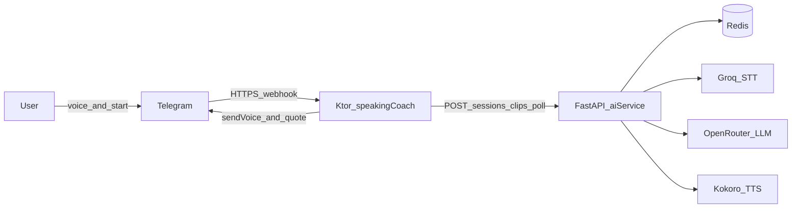
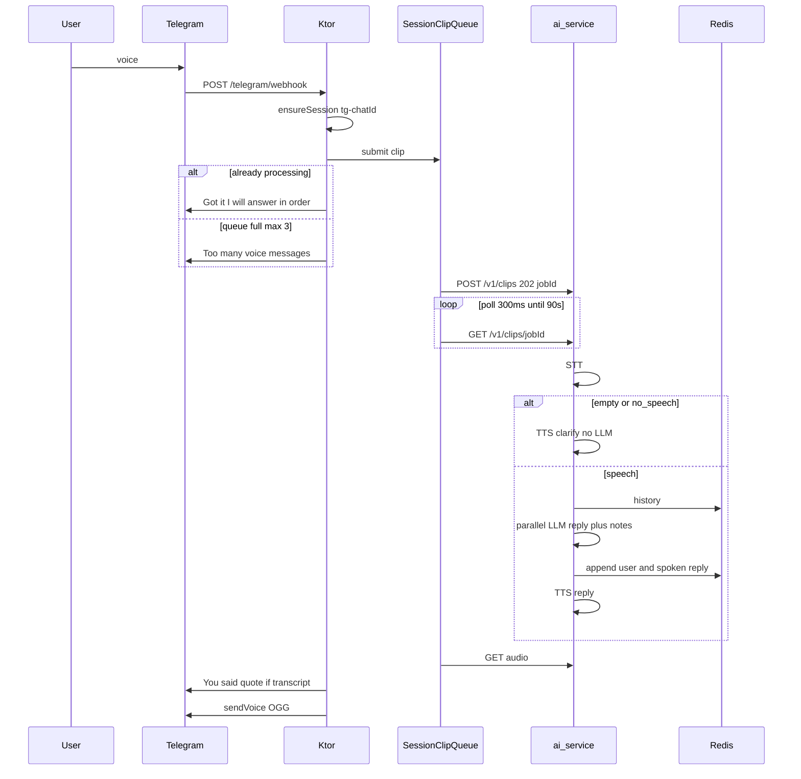
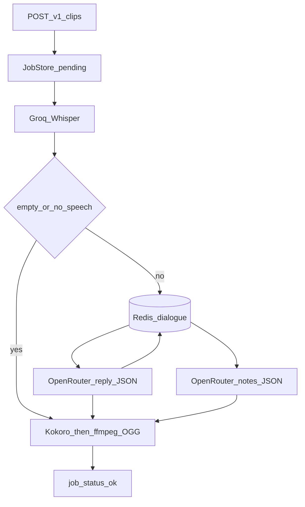
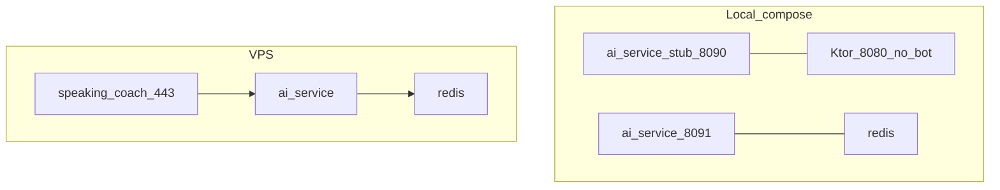

# Architecture

Глобальная карта **текущего** кода (ветка с Telegram-ботом Speaky). Не путать с `product.md`: там целевой продукт (диагностика speaking + персонализация). Сейчас в проде — голосовой диалог в Telegram, точечные grammar/lexis notes в цитате, история в Redis.

Детали контрактов: `integrations/2026-09-18-clip-session-api.md`, Telegram: `integrations/2026-09-18-telegram.md`. Карта файлов: `architecture/2026-09-18-system.md`. Деплой: `deploy.md`.

## Что есть в системе

| Слой | Где код | Роль |
| --- | --- | --- |
| Telegram | `cmp/server/.../telegram/` | Webhook, `/start`, голос, цитата, очередь |
| Ktor | `cmp/server` | TLS webhook, прокси `/v1/*`, health |
| ai-service | `ai-service/` | STT → LLM → TTS, сессии, jobs |
| Redis | контейнер `redis` | `session:{id}`, диалог до 40 сообщений, TTL 30 дней |
| Stub | `infra/ai-service-stub/` | Мок клипов без ключей |
| CMP UI | `cmp/app/` | Шаблон KMP, **не** ходит в clip API |

Внешние API: Groq Whisper (STT), OpenRouter `gpt-4o-mini` (LLM), Kokoro TTS, Telegram Bot API.

## Прод: компоненты



Ktor на VPS слушает **443** с PEM, регистрирует webhook с сертификатом. Секрет заголовка `X-Telegram-Bot-Api-Secret-Token`. Ответ Telegram **200** сразу, обработка в отдельном scope.

## Голосовой ход



Идентификатор сессии Telegram: `tg-$chatId` (`TelegramHandlers.telegramSessionId`). В Redis ключ `session:{sessionId}`. `/start` — get-or-create, историю не стирает.

## Пайплайн ai-service



- Clarify: *I didn't catch that. Could you say it again?* Notes пустые, LLM не зовётся.
- Два параллельных LLM-вызова (одна модель, один ключ): reply JSON `{"reply"}` с историей, `temperature` 0.7; notes JSON `{"notes":[{"wrong","better"}]}` **без** истории, `temperature` 0. Пайплайн ждёт оба, потом TTS и пакет в Telegram как раньше. В Redis кладётся **spoken reply**, не notes.
- Notes в job: строки `wrong|||better` (макс. 3). Цитата в Telegram: strike + bold внутри blockquote; правка на своей строке; висячая пунктуация после спана съедается.

Jobs в памяти процесса, TTL ~10 мин. Рестарт ai-service убивает незавершённые jobs, **не** Redis-диалог.

## Локально vs VPS



- `docker compose` без profile `llm`: Ktor + stub, **без** Telegram (нет webhook URL).
- `--profile llm`: реальный ai-service на хосте **8091**, Redis.
- Прод: GitHub Actions деплоит `speaking-coach`, `ai-service`, Redis; `TELEGRAM_*`, `AI_SERVICE_BASE_URL`, `REDIS_URL`. Имя/аватар бота — BotFather, не репозиторий.

## Что сознательно не в рантайме бота

CMP Android / iOS / Desktop (`App.kt`) — шаблон «Click me», к сессиям и клипам не подключены. Менять их для Speaky не нужно, пока нет отдельной задачи на клиент.

## Границы ответственности при правках

```text
Telegram UX / очередь / цитата     → cmp/server/.../telegram + speaking
HTTP клиент и OpenAPI proxy        → cmp/server/.../ai
TLS, webhook vs HTTP-only          → AppConfig.kt, Application.kt
STT LLM TTS Redis notes prompt     → ai-service/app
Compose / VPS / CI secret names    → infra/, .github/workflows
```
