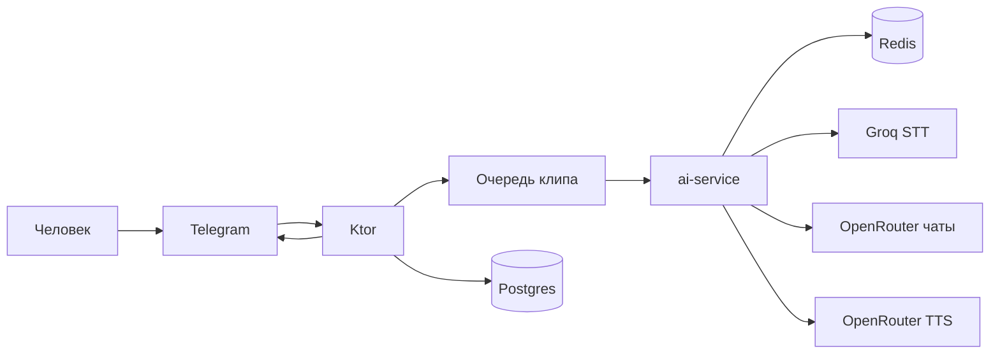
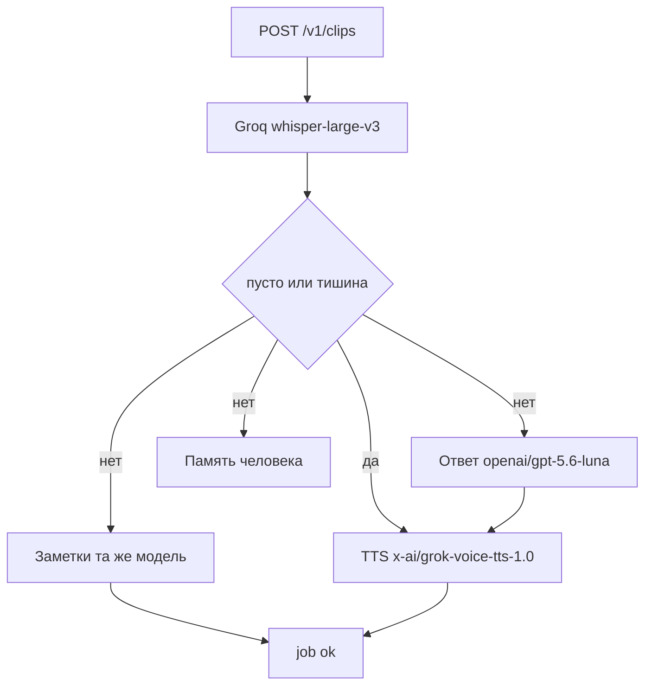
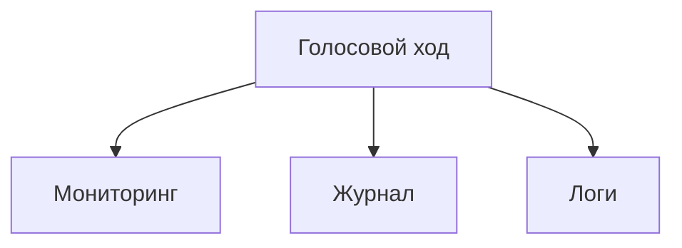

# Приёмка Telegram MVP

Короткая карта того, что реально работает в боте Speaky. Опора — `ai_docs/architecture.md`. Исследование `researches/2026-09-14-stt-llm-tts-ai-service.md` устарело. Секретов и адресов машин здесь нет.

Клиент CMP (`cmp/app`) заморожен до 15 октября 2026. Сегодня 11 октября, заморозка ещё действует: экраны Releva к боту не подключены, новых экранов в этом заходе нет.

Ветка с журналом голоса ответа и с исключением тестовых сессий на хосты не выкатывалась. Прод не менялся. DEV ai-service на время замера k6 собирался из ветки и затем возвращён к предыдущему образу.

## Путь голоса

Telegram шлёт вебхук на Ktor. Ktor отвечает 200 и кладёт голос в очередь сессии. Очередь шлёт `POST /v1/clips` в ai-service и опрашивает job. Готовый голос уходит обратно в чат.

После онбординга обычный голос — это звонок на 5, 10 или 15 минут распознанной речи, не бесконечная лента. Онбординг сам по себе — отдельные чаты оценки, не второй клип.

## Один клип

Заметки ждут не дольше 10 секунд (`NOTES_TIMEOUT_SECONDS`). Всё задание обрывается через 60 секунд, если свой таймаут в окружении не задан. Клиент провайдера создан с `max_retries=0`. На 429 и 5xx код ждёт 0.5 с и повторяет один раз. Повтор тратит квоту ещё раз.

10 клипов в секунду в опубликованный потолок Groq не входят. Нижняя цифра страницы лимитов — 20 запросов в минуту. Замер на DEV остановился там. Рабочий вывод приёмки другой: Groq принимается как способный обслужить десять человек одновременно, то есть десять пересекшихся ходов, а не десять клипов в секунду. Подробности: `2026-10-11-provider-limits.md`.

## Три хранилища

Мониторинг — агрегаты живых людей: DAU, частота ходов, ошибки сервиса, стоимость. Ключи Redis `metrics:*` и `metrics:v2:*` плюс Prometheus и Grafana на CMP. Формат старых ключей не переписывался. Тестовый клип с заголовком `X-Speaky-Load-Test: 1` в эти ключи не пишется. Заголовок есть в ветке; на работающем DEV после отката его снова нет.

Четыре метрики задания на доске Speaky (`infra/monitoring/grafana/dashboards/speaky.json`). Только `client="telegram"`, сутки по Москве. Стоимость на человека — usage.cost за день / DAU: распознавание, ответ, заметки и озвучка.

| Метрика | Панель | Ряд |
| --- | --- | --- |
| DAU | DAU: сколько человек сегодня договорили ход | `speaking_dau{client="telegram"}` |
| Частотность взаимодействия | Частотность: сколько ходов на человека сегодня | `speaking_turns{client="telegram"} / speaking_dau{client="telegram"}` |
| Ошибки сервисов | Ошибки сервисов за сегодня | `speaking_errors{client="telegram"}` |
| Стоимость на человека | Стоимость на человека сегодня, $ | `(speaking_cost_micro{client="telegram"} / 1000000) / speaking_dau{client="telegram"}` при DAU > 0 |

Журнал — полный ход для закрытой страницы истории: голос человека, текст, голос ответа модели. Голос человека уже хранится. Файл голоса ответа в этой ветке кладётся рядом, в тот же закрытый каталог, и слушается только с этой страницы. Срок тот же: 7 дней содержимое, 30 дней метаданные. На прод это не выкатывалось, старые строки и файлы не удалялись.

Логи — технический след падения: стадия, тип исключения, код ошибки. Текст человека и секреты в новые записи не кладутся.

## Выкат

Пуш и pull request гоняют тесты. На сервер они ничего не ставят.

Выкат ручной: workflow Redeploy DEV и Redeploy PROD. У каждого две галки, CMP и ai-service. Образы собираются на машине. Скрипт бэкапа Postgres, Redis и каталога аудио лежит в `infra/backup/backup-remote.sh` и в выкат не вшит.
