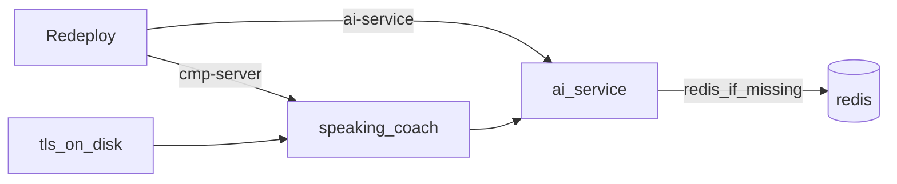

# Deploy

Как Speaky попадает на серверы. Секреты в документе **не** перечислять значениями — только имена GitHub secrets. Локальный compose — не прод; см. `integrations/2026-09-18-run-and-ci.md`.

## Что крутится на машине

Три Docker-контейнера. **Prod** сегодня часто один сервер (Ktor host-сеть + AI/Redis на localhost). **DEV** — два сервера: Ktor отдельно, ai-service+Redis отдельно.

| Контейнер | Образ | Сеть | Назначение |
| --- | --- | --- | --- |
| `speaking-coach` | `speaking-coach:local` | **host** | Ktor, TLS :443, Telegram webhook |
| `ai-service` | `ai-service:local` | `speaking-coach` | FastAPI, порт **127.0.0.1:8090** |
| `redis` | `redis:7-alpine` | `speaking-coach` | диалог, **127.0.0.1:6379**, volume `speaking-coach-redis` |

Ktor смотрит на ai-service через `AI_SERVICE_BASE_URL` (обычно `http://127.0.0.1:8090`: host-сеть видит опубликованный порт). ai-service смотрит на Redis через `REDIS_URL=redis://redis:6379/0` (имя контейнера в docker-сети).

На диске:

- `/opt/speaking-coach/` — fat JAR, `Dockerfile.runtime`, `deploy-remote.sh`, `.env`, **`tls.crt` / `tls.key` (кладёт человек, CI их не генерирует)**
- `/opt/ai-service/` — `app/`, Dockerfile, requirements, deploy-скрипты, `.env`

Рестарт `ai-service` **не** должен `docker rm redis`. Скрипт `infra/redis/deploy-remote.sh` если контейнер `redis` уже есть — только `start` + connect к сети, volume не трогает.



## Тесты авто, выкат только Redeploy

`push` / `pull_request` по path: **CMP** (`cmp/**`, `infra/server/**`) и **AI service** (`ai-service/**`, `infra/ai-service/**`, `infra/redis/**`) — package и тесты. На сервер не едут.

Выкат — [`.github/workflows/redeploy.yml`](../.github/workflows/redeploy.yml): Actions → Redeploy → **Run workflow**. Две галки `cmp-server` и `ai-service` (обе default on). Снятая галка = job skipped, workflow зелёный. Обе сняты = fail до SSH.

Куда: ветка `main`/`master` → **prod** (environment `deploy`, беспрефиксные repo secrets). Любая другая → **DEV** (environment `dev`, `DEV_*`). Environments — только approve; секреты в Environment не кладём.

Concurrency: `ktor-prod` / `ktor-dev` / `ai-prod` / `ai-dev`, `cancel-in-progress: false` (очередь, не cancelled).

### Prod — repo Actions secrets (как были)

SSH: `CMP_SERVER_HOST`, `CMP_SERVER_USER`, `CMP_SERVER_SSH_KEY`, `AI_SERVICE_HOST`, `AI_SERVICE_USER`, `AI_SERVICE_SSH_KEY`.

Runtime: раннер собирает `.env` из ячеек `TELEGRAM_BOT_TOKEN`, `TELEGRAM_WEBHOOK_SECRET`, `TELEGRAM_WEBHOOK_URL`, `AI_SERVICE_BASE_URL` (два последних ещё могут быть vars), `GROQ_API_KEY`, `OPENAI_API_KEY`. `scp` файла на хост. Скрипт env не читает — только `--env-file`. TLS PEM уже на диске. Redis не `docker rm`.

Смена бота: новый `TELEGRAM_BOT_TOKEN`, Redeploy cmp-server с `main`, у старого токена `deleteWebhook`. Имя в Telegram — BotFather.

### Dev — те же скрипты, другие ячейки

SSH: `DEV_CMP_SERVER_HOST` / `USER` / `SSH_KEY`, `DEV_AI_SERVICE_HOST` / `USER` / `SSH_KEY`.

Runtime — непрозрачные блобы (оператор заполняет, CI не парсит ключи):

- `DEV_CMP_SERVER_ENV` → `/opt/speaking-coach/.env`
- `DEV_AI_SERVICE_ENV` → `/opt/ai-service/.env` (сюда же `REDIS_URL`)

Пустой блоб — fail на раннере до SSH. TLS на DEV кладёт человек.

CMP Android / iOS / Desktop на сервер не едут. Stub — только local compose. Jobs ai-service в памяти при рестарте пропадают; Redis-диалоги остаются.

## Ручной деплой (если файлы уже на хосте)

Положить `.env`, вызвать скрипт. Env на хост не передаём.

```bash
bash /opt/speaking-coach/deploy-remote.sh
bash /opt/ai-service/deploy-redis.sh
bash /opt/ai-service/deploy-remote.sh
```

Проверка: `docker ps` — три имени выше; с хоста `curl -k https://127.0.0.1/health` (Ktor) и `curl http://127.0.0.1:8090/health` (ai-service).
