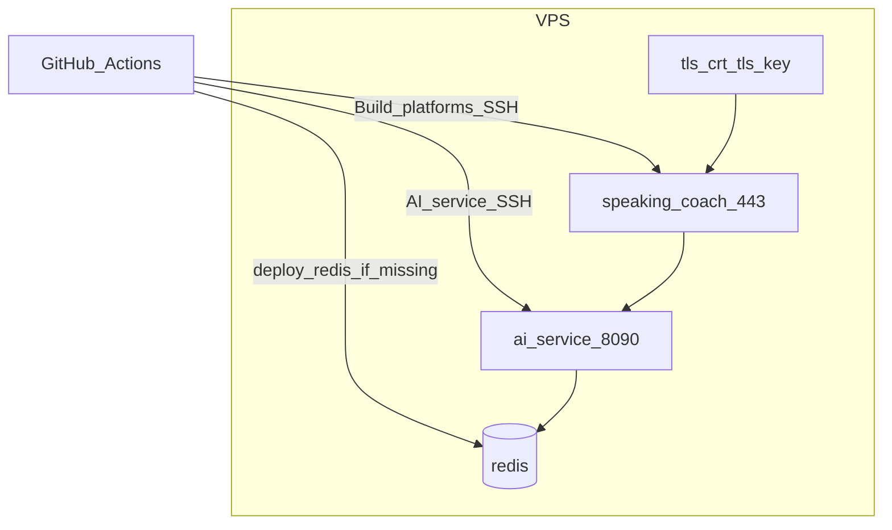

# Deploy

Как Speaky попадает на VPS. Секреты в документе **не** перечислять значениями — только имена GitHub secrets / vars. Локальный compose — не прод; см. `integrations/2026-09-18-run-and-ci.md`.

## Что крутится на машине

Три Docker-контейнера на одном хосте:

| Контейнер | Образ | Сеть | Назначение |
| --- | --- | --- | --- |
| `speaking-coach` | `speaking-coach:local` | **host** | Ktor, TLS :443, Telegram webhook |
| `ai-service` | `ai-service:local` | `speaking-coach` | FastAPI, порт **127.0.0.1:8090** |
| `redis` | `redis:7-alpine` | `speaking-coach` | диалог, **127.0.0.1:6379**, volume `speaking-coach-redis` |

Ktor смотрит на ai-service через `AI_SERVICE_BASE_URL` (обычно `http://127.0.0.1:8090`: host-сеть видит опубликованный порт). ai-service смотрит на Redis через `REDIS_URL=redis://redis:6379/0` (имя контейнера в docker-сети).

На диске:

- `/opt/speaking-coach/` — fat JAR, `Dockerfile.runtime`, `deploy-remote.sh`, `.env`, **`tls.crt` / `tls.key` (кладёт человек, CI их не генерирует)**
- `/opt/ai-service/` — `app/`, Dockerfile, requirements, deploy-скрипты, `.env`

Рестарт `ai-service` **не** должен `docker rm redis`. Скрипт `infra/redis/deploy-remote.sh` если контейнер `redis` уже есть — только `start` + connect к сети, volume не трогает.



## Два независимых пайплайна

Менять промпт / STT — workflow **AI service**. Менять цитату Telegram / webhook — **Build platforms** (server deploy). Оба ходят в GitHub Environment **`deploy`** (approve, если так настроено).

### 1. Ktor / бот — `.github/workflows/build-platforms.yml`

Триггеры: `push`/`pull_request` по `cmp/**`, `infra/server/**`, сам workflow; либо **workflow_dispatch** (галка `deploy` в UI; job `server-deploy` всё равно стартует после успешного `server-package` — реальный стоп это environment).

Цепочка:

1. Detekt, `:server:test`, `:server:buildFatJar`
2. Artifact `server-all.jar`
3. Job **Server deploy**: scp JAR + `Dockerfile.runtime` + `infra/server/deploy-remote.sh` → `/opt/speaking-coach/`
4. На VPS скрипт пишет `.env` (`SERVER_PORT=443`, пути TLS), `docker build`, `docker rm -f speaking-coach`, `docker run --network host --restart unless-stopped`

При старте контейнер вызывает Telegram `setWebhook` на `TELEGRAM_WEBHOOK_URL` с секретом и сертификатом.

Secrets / vars (имена): `CMP_SERVER_HOST`, `CMP_SERVER_USER`, `CMP_SERVER_SSH_KEY`, `TELEGRAM_BOT_TOKEN`, `TELEGRAM_WEBHOOK_SECRET`, `TELEGRAM_WEBHOOK_URL` (secret или var), `AI_SERVICE_BASE_URL` (secret или var).

Смена бота: новый `TELEGRAM_BOT_TOKEN`, задеплоить Ktor, у старого токена `deleteWebhook`. Имя в Telegram — BotFather, не репозиторий.

### 2. ai-service + Redis — `.github/workflows/ai-service.yml`

Триггеры: `push`/`pull_request` по `ai-service/**`, `infra/ai-service/**`, `infra/redis/**`, сам workflow; **workflow_dispatch** с `deploy` (по умолчанию true). На `workflow_dispatch` с `deploy=false` job Deploy пропускается.

Цепочка:

1. pytest (Python 3.12)
2. Artifact: Dockerfile, requirements, `app/`
3. scp в `/opt/ai-service/` (старый `app/` сносится)
4. `bash /opt/ai-service/deploy-redis.sh` (= `infra/redis/deploy-remote.sh`)
5. `bash /opt/ai-service/deploy-remote.sh` с `GROQ_API_KEY` / `OPENAI_API_KEY`

Deploy-remote: пишет `.env` (OpenRouter URL, модели по умолчанию, Redis URL), `docker rm -f ai-service`, новый контейнер на сети `speaking-coach`, порт только localhost.

Secrets: `AI_SERVICE_HOST`, `AI_SERVICE_USER`, `AI_SERVICE_SSH_KEY`, `GROQ_API_KEY`, `OPENAI_API_KEY`. Host часто тот же VPS, что и у Ktor.

## Что не деплоится этим процессом

- CMP Android / iOS / Desktop — собираются в Build platforms как артефакты, на VPS не едут.
- Stub `ai-service-stub` — только local compose.
- TLS: если нет `/opt/speaking-coach/tls.crt|key`, server deploy **падает**.
- In-memory jobs ai-service при рестарте контейнера пропадают; Redis-диалоги остаются.

## Ручной деплой (если CI уже положил файлы)

На хосте, с нужными env:

```bash
# бот
TELEGRAM_BOT_TOKEN=... TELEGRAM_WEBHOOK_SECRET=... \
TELEGRAM_WEBHOOK_URL=... AI_SERVICE_BASE_URL=http://127.0.0.1:8090 \
bash /opt/speaking-coach/deploy-remote.sh

# redis (идемпотентно) + ai-service
bash /opt/ai-service/deploy-redis.sh
GROQ_API_KEY=... OPENAI_API_KEY=... bash /opt/ai-service/deploy-remote.sh
```

Проверка: `docker ps` — три имени выше; с хоста `curl -k https://127.0.0.1/health` (Ktor) и `curl http://127.0.0.1:8090/health` (ai-service).
