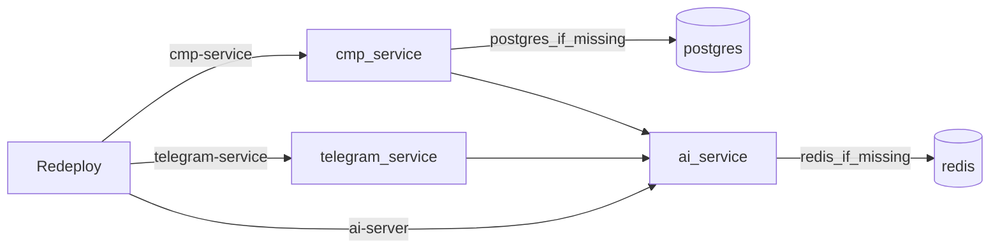

# Deploy

Как Speaky и клиентский API попадают на серверы. Секреты в документе **не** перечислять значениями — только имена GitHub secrets. Локальный compose — не прод; см. `integrations/2026-09-18-run-and-ci.md`.

## Что крутится на машине

Kotlin-процессы разделены. **cmp-service** — HTTP для мобилки и десктопа. **telegram-service** — только бот. **ai-service** и Redis по-прежнему отдельно. Postgres живёт на хосте cmp-service.

| Контейнер | Образ | Сеть | Назначение |
| --- | --- | --- | --- |
| `cmp-service` | `cmp-service:local` | **host** | App API, порт из `SERVER_PORT` в `.env` (обычно 443) |
| `telegram-service` | `telegram-service:local` | **host** | Telegram webhook, напоминания, `/admin/metrics`. Свой `SERVER_PORT`, не тот же, что у cmp-service на одной машине |
| `postgres` | `postgres:16-alpine` | loopback | пользователи app API, **127.0.0.1:5432**, volume `speaking-coach-postgres` (хост cmp-service) |
| `ai-service` | `ai-service:local` | `speaking-coach` | FastAPI, порт **8090** на всех интерфейсах |
| `redis` | `redis:7-alpine` | `speaking-coach` | диалог, **127.0.0.1:6379**, volume `speaking-coach-redis` |

Оба Kotlin-сервиса ходят в ai-service через `AI_SERVICE_BASE_URL` — адрес, который виден **с их машины** (публичный IP/DNS), не `127.0.0.1` и не VPC Timeweb. Хост-порт FastAPI — `AI_SERVICE_PORT` в `.env` на AI (по умолчанию 8090); скрипт делает `-p $AI_SERVICE_PORT:8090`. Docker публикует его на всех интерфейсах, а `restrict-8090.sh` режет чужие source в `DOCKER-USER` / `INPUT`: пускает loopback и адреса из `/opt/ai-service/8090.allow`. Без файла снаружи порт закрыт. Redis остаётся на AI-хосте. `REDIS_URL=redis://redis:6379/0`.

На диске:

- `/opt/cmp-service/` — fat JAR, `Dockerfile.runtime`, `deploy-remote.sh`, `.env`, **`tls.crt` / `tls.key` (кладёт человек, CI их не генерирует)**
- `/opt/telegram-service/` — то же для бота. Если TLS ещё лежит в `/opt/speaking-coach/`, первый деплой копирует `tls.crt` и `tls.key`
- `/opt/ai-service/` — `app/`, Dockerfile, requirements, deploy-скрипты, `.env`, **`8090.allow`**

Старый контейнер `speaking-coach` скрипты **не** останавливают. Пока он держит порт, новый процесс с тем же `SERVER_PORT` не стартует. Сначала поднять `telegram-service` (свой хост или другой порт и новый `TELEGRAM_WEBHOOK_URL`), затем остановить `speaking-coach`, затем выкатить `cmp-service` на публичный 443.

Рестарт `ai-service` **не** должен `docker rm redis`. Рестарт `cmp-service` **не** должен `docker rm postgres`. Без `POSTGRES_PASSWORD` в `.env` cmp-service Postgres не поднимается.


```mermaid
flowchart LR
  redeploy[Redeploy]
  cmp[cmp_service]
  tg[telegram_service]
  postgres[(postgres)]
  ai[ai_service]
  redis[(redis)]
  redeploy -->|cmp-service| cmp
  redeploy -->|telegram-service| tg
  redeploy -->|ai-server| ai
  ai -->|redis_if_missing| redis
  cmp -->|postgres_if_missing| postgres
  cmp --> ai
  tg --> ai
```

Имя секрета — процесс, не машина. На одном хосте у сервисов совпадают `HOST` / `USER` / `SSH_KEY` и различается `ENV`. Выкат снимает только свой контейнер.

## Тесты авто, выкат только Redeploy

`push` / `pull_request` по path: **CMP** (`cmp/**`, `infra/cmp-service/**`, `infra/telegram-service/**`, `infra/postgres/**`) и **AI service** (`ai-service/**`, `infra/ai-service/**`, `infra/redis/**`) — package и тесты. На сервер не едут.

Выкат — два `workflow_dispatch`, ветка раннер не выбирает:

- [`.github/workflows/redeploy.yml`](../.github/workflows/redeploy.yml) — **Redeploy DEV**, secrets `DEV_*`
- [`.github/workflows/redeploy-prod.yml`](../.github/workflows/redeploy-prod.yml) — **Redeploy PROD**, secrets `PROD_*`

**Redeploy PROD** не менялся: галки `cmp-server` и `ai-server`, JAR `server-all.jar` в `/opt/speaking-coach`, секреты `PROD_CMP_SERVER_*` и `PROD_AI_SERVER_*`. На этой ветке модуля `:server` нет, поэтому нажатие падает на сборке и до SSH не доходит.

**Redeploy DEV:** галки `cmp-service`, `telegram-service`, `ai-service` (все default on). Снятая галка = job skipped, workflow зелёный. Все сняты = fail до SSH. В Deployments только `deploy-prod` и `deploy-dev`. Секреты — repository Actions secrets.

Concurrency: `cmp-service-dev` / `telegram-service-dev` / `ai-prod` / `ai-dev`, `cancel-in-progress: false`. Прод-группа Ktor по-прежнему `ktor-prod` / `ktor-dev` у старого `deploy-cmp-server.yml`.

### Prod

Workflow как на `main`. SSH: `PROD_CMP_SERVER_HOST` / `USER` / `SSH_KEY`, `PROD_AI_SERVER_HOST` / `USER` / `SSH_KEY`.

- `PROD_CMP_SERVER_ENV` → `/opt/speaking-coach/.env`
- `PROD_AI_SERVER_ENV` → `/opt/ai-service/.env` (`REDIS_URL` только здесь; `AI_INTERNAL_TOKEN` тот же, что у Ktor)

Пустой блоб — fail на раннере до SSH. TLS PEM уже на диске. Redis не `docker rm`. Смена бота: новый токен внутри `PROD_CMP_SERVER_ENV`, Redeploy PROD с галкой cmp-server, у старого токена `deleteWebhook`. Имя в Telegram — BotFather.

CMP packages на `main` пекут `https://$PROD_CMP_SERVER_HOST`.

### Dev

Секреты по имени сервиса. Один хост допустим: одинаковые `HOST` / `USER` / `SSH_KEY`, разные `ENV` и `SERVER_PORT`.

- `DEV_CMP_SERVICE_HOST` / `USER` / `SSH_KEY` / `ENV` → `/opt/cmp-service/.env` (`JWT_SECRET`, `DATABASE_URL`, `POSTGRES_PASSWORD`, `AI_SERVICE_BASE_URL`, `AI_INTERNAL_TOKEN`, `SERVER_PORT`)
- `DEV_TELEGRAM_SERVICE_HOST` / `USER` / `SSH_KEY` / `ENV` → `/opt/telegram-service/.env` (`TELEGRAM_*`, тот же `AI_INTERNAL_TOKEN`, свой `SERVER_PORT`). `METRICS_PASSWORD` дописывает CI из одноимённого secret, если он задан
- `DEV_AI_SERVICE_HOST` / `USER` / `SSH_KEY` / `ENV` → `/opt/ai-service/.env` (`REDIS_URL`, тот же `AI_INTERNAL_TOKEN`, `OPENAI_REALTIME_API_KEY`)

Пакеты клиента не с `main` пекут `https://$DEV_CMP_SERVICE_HOST`. Старый контейнер `speaking-coach` скрипты не удаляют.

CMP Android / iOS / Desktop на сервер не едут. Jobs ai-service в памяти при рестарте пропадают; Redis-диалоги остаются.

## Ручной деплой (если файлы уже на хосте)

```bash
bash /opt/cmp-service/deploy-postgres.sh
bash /opt/cmp-service/deploy-remote.sh
bash /opt/telegram-service/deploy-remote.sh
bash /opt/ai-service/deploy-redis.sh
bash /opt/ai-service/deploy-remote.sh
```

Проверка: `docker ps`; с хоста cmp-service `curl -k https://127.0.0.1/health`; с хоста AI `curl http://<ai-server>:8090/health`.
