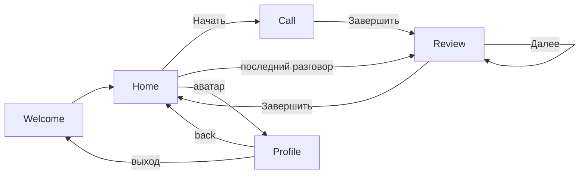

# Мобильный UI (макеты Releva)

**Дата:** 2026-09-17  
**Статус:** исходники — PNG-скрины, не Figma; CMP-клиент копирует Welcome/Home/Call/Grammar/Vocabulary/Profile. История и шаги Pronunciation / Fluency / Speed of speech **отложены** (макеты 06–09 есть, в приложении нет).  
**Связанные документы:** `ai_docs/product.md`, `ai_docs/plans/mvp-plan.md`, `ai_docs/architecture/2026-09-17-cmp-client.md`

Бренд на макетах — **Releva**. В репозитории продукт по-прежнему Speaking Coach (`ai_docs/product.md`). Для UI копировать визуал этих экранов, не шаблон Compose «Click me».

Картинки: [`screens/`](screens/).

## Поток

```text
Welcome → Home ⇄ Call → разбор 1…2/2 → Home
Home (аватар) → Profile → back / выход
```

Нижнего таббара нет. Профиль — отдельный экран стека с Home (аватар в шапке). Макет `09-history.png` сохранён, экран Истории в клиенте не собирается.



Разбор в клиенте: Grammar → Vocabulary. Макеты Pronunciation / Fluency / Speed of speech сохранены, в карусели **нет**.

| # | Экран | Файл | Что на нём |
| --- | --- | --- | --- |
| 1 | Welcome | [01-welcome.png](screens/01-welcome.png) | Логотип Releva, «Говорите на английском **уверенно**», «Начать», «У меня уже есть аккаунт», условия и политика |
| 2 | Home | [02-home.png](screens/02-home.png) | «Привет, Алекс!», карточка «Начать разговор», чипы темы, «Последний разговор». Нижних табов нет. **Сверх PNG:** под логотипом полоска «Цель на день» + streak |
| 3 | Call | [03-call.png](screens/03-call.png) | Звонок: логотип с кольцами, таймер, субтитры AI, mute / завершить / CC |
| 4 | Разбор · Grammar | [04-review-grammar.png](screens/04-review-grammar.png) | **1/2**, 78/100, времена и предлоги, «Ты сказал» / «Лучше», «Далее» |
| 5 | Разбор · Vocabulary | [05-review-vocabulary.png](screens/05-review-vocabulary.png) | **2/2**, 84/100, simple words / very + adjective, **«Завершить»** |
| 6 | Разбор · Pronunciation | [06-review-pronunciation.png](screens/06-review-pronunciation.png) | Макет сохранён. В клиенте **не** в карусели |
| 7 | Разбор · Fluency | [07-review-fluency.png](screens/07-review-fluency.png) | Макет сохранён. В клиенте **не** в карусели |
| 8 | Разбор · Speed of speech | [08-review-speed-of-speech.png](screens/08-review-speed-of-speech.png) | Макет сохранён. В клиенте **не** в карусели |
| 9 | История | [09-history.png](screens/09-history.png) | Макет сохранён. В клиенте **не** реализован |
| 10 | Профиль | [10-profile.png](screens/10-profile.png) | Аккаунт, язык, голос репетитора, **цель на день (пресет минут)**, CC по умолчанию, микрофон, юр.ссылки, выход. Без табов и без стрелки назад в шапке |

Каркас разбора общий: back, title «Разбор разговора», `N/2`, метрика + балл, серый лид, белая карточка буллетов, карточка примеров, совет, нижний CTA.

## Визуальный язык (со скринов, не из кода)

- Фон: тёплый почти-белый. Welcome/Home/Call — **радиальные кружки**: голубое ядро (`primary` ~18%) через mist/soft и мягкий уход в фон, без жёсткой обрезки. Hero-карточка — радиал из правого верхнего угла. Разбор и Профиль — более плоский светлый фон.
- Акцент и primary-кнопки: насыщенный синий; слово «уверенно» тем же синим.
- Текст: Inter (Regular / Medium / Bold) в `composeResources/font`. Почти чёрный заголовок, серый подзаголовок.
- Карточки и чипы: белые, крупное скругление; выбранный чип — синяя обводка и лёгкая голубая заливка.
- Hangup: красный круг. «Выйти из аккаунта»: красный текст, не кнопка hangup.
- Разбор: балл синим, правки синим, совет — голубая плашка с лампочкой.
- Тёмной темы на макетах нет. Dark — те же роли, что light: CTA `#1874FC`, фон `#0E1020` (ink), карточки светлее фона `#1C2030`, пятна тихий navy, hangup `#FC3434`. Не M3-пастельный инверт.

Hex в `ui/theme/Color.kt` — медиана/кластер с PNG 2026-09-17, не с глаз:

| Роль | Hex | `ColorScheme` |
| --- | --- | --- |
| CTA / акцент | `#1874FC` | `primary` |
| Фон | `#FBFAF6` | `background` / `surface` |
| Пятна / внешние кольца | `#F0F4FC` | `surfaceContainerHigh` |
| Hero / аватары / выбранный чип | `#ECF0FC` | `primaryContainer` |
| Совет | `#E9EFFD` | `secondaryContainer` |
| Заголовок | `#0E1020` | `onBackground` / `onSurface` |
| Приглушённый текст | `#9B9EA4` | `onSurfaceVariant` |
| Карточка | `#FFFFFF` / `#FCFCFC` | `surfaceContainerLowest` / `Low` |
| Обводка | `#E4E4E4` | `outline` |
| Полоска цели | `#FFFFFF` / `#DFE2E8` | `surfaceContainerHighest` / `outlineVariant` |
| Hangup | `#FC3434` | `error` |
| Streak / огонь | `#E85D04` | `tertiary` |

## Как это ложится на продукт

В клиенте сейчас два шага разбора: Grammar и Vocabulary. Pronunciation / Fluency / Speed of speech есть только как PNG (06–08), в карусели нет — как История.

- Тема разговора выбирается **до** звонка.
- Home: под логотипом мок «Цель на день» (секунды из цели в минутах) и streak; полоска `#FFFFFF` / `#DFE2E8`, огонь `tertiary`. Цель задаётся в Профиле пресетами 5/10/15/20 мин.
- Разбор — карусель `1…2/2` (Grammar, Vocabulary), не один экран «2–3 слабых места».
- Call: mute / hangup / CC. Неделя 2: без кнопки Send на каждую реплику. Hangup и mute совместимы с авто-слушанием.
- Профиль закрывает аватар на Home и настройки CC/микрофон/голос. Логин с Welcome по-прежнему без отдельного макета.
- История на макете — список сессий с урезанными баллами. В клиенте отложена. Карточка «Последний разговор» на Home в макете/моке есть; живой API в MVP не делаем (разбор только сразу после Call).

## Чего всё ещё нет

- экраны Pronunciation / Fluency / Speed of speech (макеты 06–08);
- экран Истории (макет 09);
- экраны после «Начать» / «У меня уже есть аккаунт»;
- пустой Home без последнего разговора;
- состояния Call: connecting, слушаем, говорит AI, CC выключены;
- системные: permission микрофона, сеть, ошибка сессии;
- детальные экраны настроек (язык, голос, проверка микрофона);
- упражнения после разбора (неделя 4 — не ядро).

## Для агента

Копировать **эти** экраны, не nowinandroid и не шаблон `App()`. Строки — `composeResources` (скилл `cmp-strings`), иконки — XML (скилл `cmp-icons`), цвета/тип — `ui/theme` (скилл `cmp-theme`).

UI-оболочка в `:app:shared`: Nav3, без табов, мок-контент с макетов. HTTP не вызывать, пока не согласован контракт с бэком (`SpeakingCoachClient`).
