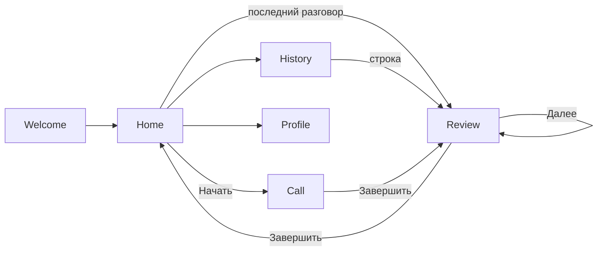

# Мобильный UI (макеты Releva)

**Дата:** 2026-09-17  
**Статус:** исходники — PNG-скрины, не Figma; с этого можно начинать CMP-клиент  
**Связанные документы:** `ai_docs/product.md`, `ai_docs/plans/mvp-plan.md`, `ai_docs/architecture/2026-09-17-cmp-client.md`

Бренд на макетах — **Releva**. В репозитории продукт по-прежнему Speaking Coach (`ai_docs/product.md`). Для UI копировать визуал этих экранов, не шаблон Compose «Click me».

Картинки: [`screens/`](screens/).

## Поток

```text
Welcome → Home ⇄ Call → разбор 1…5/5 → Home
табы: Главная / История / Профиль
История → разбор (строка сессии)
```



Разбор по счётчику на макетах:

1. Grammar → 2. Vocabulary → 3. Pronunciation → 4. Fluency → 5. Speed of speech

| # | Экран | Файл | Что на нём |
| --- | --- | --- | --- |
| 1 | Welcome | [01-welcome.png](screens/01-welcome.png) | Логотип Releva, «Говорите на английском **уверенно**», «Начать», «У меня уже есть аккаунт», условия и политика |
| 2 | Home | [02-home.png](screens/02-home.png) | «Привет, Алекс!», карточка «Начать разговор», чипы темы, «Последний разговор». На этом кадре **нет** нижних табов |
| 3 | Call | [03-call.png](screens/03-call.png) | Звонок: логотип с кольцами, таймер, субтитры AI, mute / завершить / CC |
| 4 | Разбор · Grammar | [04-review-grammar.png](screens/04-review-grammar.png) | **1/5**, 78/100, времена и предлоги, «Ты сказал» / «Лучше», «Далее» |
| 5 | Разбор · Vocabulary | [05-review-vocabulary.png](screens/05-review-vocabulary.png) | **2/5**, 84/100, simple words / very + adjective |
| 6 | Разбор · Pronunciation | [06-review-pronunciation.png](screens/06-review-pronunciation.png) | **3/5**, 73/100, th / w / -ed, IPA «Попробуй», не as-was цитаты |
| 7 | Разбор · Fluency | [07-review-fluency.png](screens/07-review-fluency.png) | **4/5**, 81/100, паузы и filler words, «Более плавно» |
| 8 | Разбор · Speed of speech | [08-review-speed-of-speech.png](screens/08-review-speed-of-speech.png) | **5/5**, 76/100, wpm, «Попробуй так» / «Зачем», **«Завершить»** |
| 9 | История | [09-history.png](screens/09-history.png) | Список прошлых разговоров: тема-заголовок, длительность и дата, баллы Grammar / Vocabulary / Pronunciation. Табы, активна История |
| 10 | Профиль | [10-profile.png](screens/10-profile.png) | Аккаунт, язык, голос репетитора, CC по умолчанию, микрофон, юр.ссылки, выход. Табы, активен Профиль |

Каркас разбора общий: back, title «Разбор разговора», `N/5`, метрика + балл, серый лид, белая карточка буллетов, карточка примеров, совет, нижний CTA. Pronunciation отличается средней карточкой (слово + транскрипция).

## Визуальный язык (со скринов, не из кода)

- Фон: тёплый почти-белый. Welcome/Home/Call — **радиальные кружки**: голубое ядро (`primary` ~18%) через mist/soft и мягкий уход в фон, без жёсткой обрезки. Hero-карточка — радиал из правого верхнего угла. Разбор и Профиль — более плоский светлый фон.
- Акцент и primary-кнопки: насыщенный синий; слово «уверенно» тем же синим.
- Текст: почти чёрный заголовок, серый подзаголовок.
- Карточки и чипы: белые, крупное скругление; выбранный чип — синяя обводка и лёгкая голубая заливка.
- Hangup: красный круг. «Выйти из аккаунта»: красный текст, не кнопка hangup.
- Разбор: балл синим, правки синим, совет — голубая плашка с лампочкой.
- Табы на Истории и Профиле: иконка + подпись, активный — синий. На кадре Home табов нет.
- Тёмной темы на макетах нет. `AppTheme` всё равно должен иметь dark (система / sandbox); палитру dark не выдумывать.

Hex в `ui/theme/Color.kt` — медиана/кластер с PNG 2026-09-17, не с глаз:

| Роль | Hex | `ColorScheme` |
| --- | --- | --- |
| CTA / акцент | `#1874FC` | `primary` |
| Фон | `#FBFAF6` | `background` / `surface` |
| Пятна / внешние кольца | `#F0F4FC` | `surfaceContainerHigh` |
| Hero / аватары / выбранный чип | `#ECF0FC` | `primaryContainer` |
| Совет | `#E9EFFD` | `secondaryContainer` |
| Заголовок | `#0E1020` | `onBackground` / `onSurface` |
| Приглушённый текст | `#9B9EA4` | `onSurfaceVariant` |
| Карточка | `#FFFFFF` / `#FCFCFC` | `surfaceContainerLowest` / `Low` |
| Обводка | `#E4E4E4` | `outline` |
| Hangup | `#FC3434` | `error` |

## Как это ложится на продукт

Четыре аспекта из `product.md` (Grammar / Vocabulary / Pronunciation / Fluency) на макетах есть, плюс Speed of speech отдельным шагом (в плане — часть fluency).

- Тема разговора выбирается **до** звонка.
- Разбор — карусель `1…5/5`, не один экран «2–3 слабых места». Для MVP можно позже сузить набор шагов, каркас не менять.
- Call: mute / hangup / CC. Неделя 2: без кнопки Send на каждую реплику. Hangup и mute совместимы с авто-слушанием.
- Профиль закрывает аватар на Home и настройки CC/микрофон/голос. Логин с Welcome по-прежнему без отдельного макета.
- История — список сессий с урезанными баллами (Grammar / Vocabulary / Pronunciation, без Fluency и Speed). Строка ведёт в разбор.

## Чего всё ещё нет

- нижние табы на Home (на кадре Home их нет — на Истории и Профиле есть);
- пустая История;
- экраны после «Начать» / «У меня уже есть аккаунт»;
- пустой Home без последнего разговора;
- состояния Call: connecting, слушаем, говорит AI, CC выключены;
- системные: permission микрофона, сеть, ошибка сессии;
- детальные экраны настроек (язык, голос, проверка микрофона);
- упражнения после разбора (неделя 4 — не ядро).

## Для агента

Копировать **эти** экраны, не nowinandroid и не шаблон `App()`. Строки — `composeResources` (скилл `cmp-strings`), иконки — XML (скилл `cmp-icons`), цвета/тип — `ui/theme` (скилл `cmp-theme`).

UI-оболочка уже в `:app:shared`: Nav3 + табы + мок-контент с макетов. На кадре Home табов нет, в коде на Home они есть — иначе История недоступна. HTTP не вызывать, пока не согласован контракт с бэком (`SpeakingCoachClient`).
