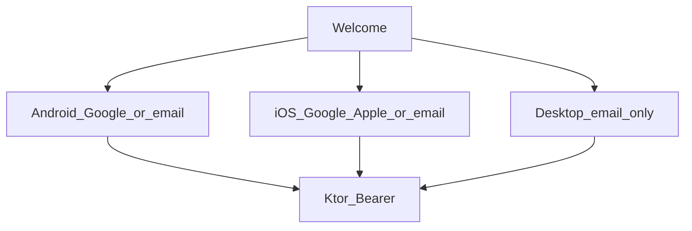
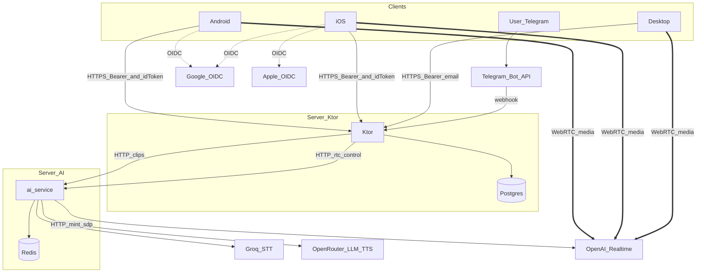
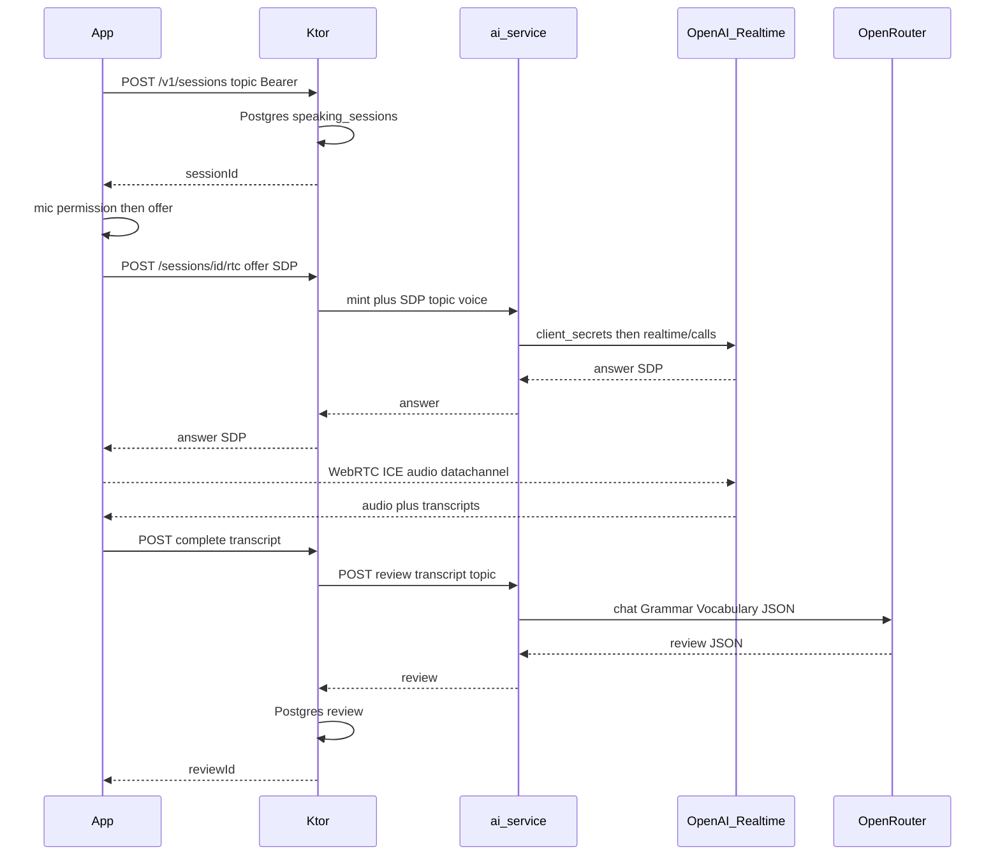
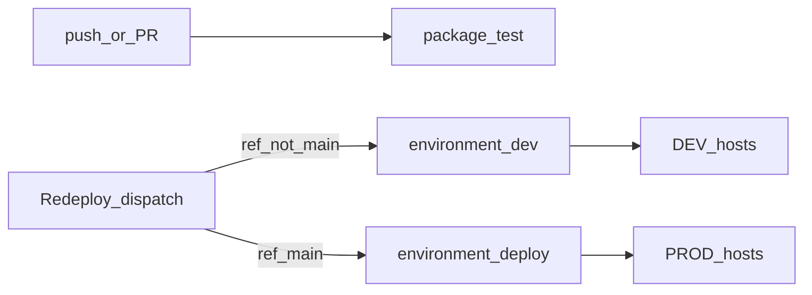

# Живой MVP на текущих экранах

**Дата:** 2026-09-19  
**Статус:** широкий бэклог (сторы, OAuth, SMTP, dual-host, CI PR→dev). Импл **этого** объёма не начат.  
**Сейчас делаем:** [mvp-backend-plan.md](mvp-backend-plan.md) — срез «бэк готов». Ветка `feature/back-for-mobile`.  
**Связанные документы:** [mvp-plan.md](mvp-plan.md) (полный продуктовый цикл — не этот срез), [../design/2026-09-17-mobile-ui.md](../design/2026-09-17-mobile-ui.md), [../architecture/2026-09-17-cmp-client.md](../architecture/2026-09-17-cmp-client.md), [../integrations/2026-09-18-clip-session-api.md](../integrations/2026-09-18-clip-session-api.md), [../summaries/2026-09-18-agent-start-here.md](../summaries/2026-09-18-agent-start-here.md)

Клипы Telegram как есть. Call: Ktor — публичная прокси (Bearer/SDP), ai-service — промпт и mint OpenAI Realtime. Медиа WebRTC клиент ↔ OpenAI, не через FastAPI. Прод-бота не трогаем.

## Срезы

- [ ] Контракт: auth/home/review + RTC через Ktor-прокси; mint/промпт в ai-service; Telegram clips без изменений
- [ ] Postgres + Google/Apple OAuth + email/пароль + Bearer
- [ ] App-сессии, home/me/complete/review; один POST rtc (mint+SDP) в ai-service
- [ ] Ktor client, token store, Welcome→AuthScreen, Home/Profile/Review живые; моки только Preview
- [ ] CMP Call: mic first, один POST rtc+SDP; WebRTC actual android/ios/jvm; user+assistant transcript
- [ ] CI: push/PR = тесты; выкат только Redeploy (`main` → prod, иначе DEV)
- [ ] Два dev-хоста: Ktor и AI+Redis; `DEV_*` SSH + `DEV_*_ENV` блобы
- [ ] ai-service: mint Realtime + spoken prompt; после hangup LLM-разбор Grammar/Vocabulary; клипы не трогаем

Цель: убрать `MockSpeakingData` из продакшен-пути (Welcome / Home / Call / Review / Profile). Сначала Ktor (auth/сессии), потом клиент. Клиповый Python не переписываем. Для Call добавляем в ai-service **управление сессией** (промпт, голос, mint). Вход: Google, Apple, почта+пароль.

### Почему без History / pronunciation / fluency / упражнений

Это не вырезание из продукта. В ветке CMP UI их **уже отложили**: карусель только Grammar→Vocabulary (`ReviewMetric` без Pronunciation/Fluency/Speed), экрана History нет, упражнений никогда не было. В репо остались PNG `06`–`09` и макетные заметки — не Compose и не API.

Живой бэк под несуществующий UI не делаем. Карточка Home «Последний разговор» **выпала из среза** [mvp-backend-plan.md](mvp-backend-plan.md): Review только после Call. Полный цикл из `mvp-plan` / `product.md` — отдельная задача, когда появятся экраны.

### Почему авторизация казалась «ушедшей»

Её не вырезали из продукта. На Welcome обе кнопки сейчас просто открывают Home без логина; отдельного макета входа нет. В первом черновике этого плана Google уехал в «позже» после выбора «email сейчас, Google потом». Для продакшена это слабый срез: возвращаем OAuth в этот MVP.

Ktor проверяет token провайдера, upsert user, выдаёт свой Bearer. Client id и ключи — только GitHub secrets / env.

Протокол: **OAuth 2.0 + OpenID Connect у Google и Apple**, не свой authorization server. Это не дыра: мы не IdP для чужих приложений, свой `/authorize` только раздувает поверхность атаки. Паттерн «проверить ID token → свой session token» — штатный backend flow Google/Apple.

- Клиент (Google Sign-In / SIWA SDK) проходит OAuth 2.0 Authorization Code + PKCE у провайдера и получает **ID token** (JWT).
- Ktor не отдаёт `/authorize` и `/token`. `POST /v1/auth/google` и `POST /v1/auth/apple` проверяют JWT по JWKS (`iss`, подпись, `exp`, **`aud` = наши client id**) и выдают **наш** opaque Bearer. Google **access token** не принимаем.
- Почта + пароль — не OAuth (password grant в OAuth 2.0 как раз не рекомендуют). TLS + hash пароля (bcrypt/argon2) + лимит попыток на login/register; тот же Bearer.
- API дальше — `Authorization: Bearer <наш токен>`, не Google access token. На диске клиента — не plaintext prefs. Logout и смена пароля отзывают токены. Токены/ID token не логируем.
- Склейка аккаунтов по email **только если почта подтверждена провайдером** (`email_verified`) или нашим verify. Нельзя зарегистрировать чужой `user@gmail.com` паролем и перехватить Google-логин.
- Реальная дыра, которую закрываем: публичный `/v1/clips` без Bearer на `:443`.

### Варианты входа по платформам

Один Welcome, набор кнопок зависит от `expect`/`actual`. «Начать» = регистрация выбранным способом, «У меня уже есть аккаунт» = тот же набор, режим login. Logout везде чистит Bearer и стопку.

- **Android**
  - Google Sign-In (ID token → `POST /v1/auth/google`)
  - почта + пароль (`register` / `login`)
  - Sign in with Apple нет (нет системного SIWA)
- **iOS**
  - Google Sign-In (тот же `idToken`)
  - Sign in with Apple (`identityToken` → `POST /v1/auth/apple`) — нужен, если на экране есть Google
  - почта + пароль
- **Desktop (JVM / hot-reload)**
  - только почта + пароль
  - Google и Apple SDK на JVM не подключаем, кнопок нет
  - звонок живой (микрофон + плеер), не мок
- **Telegram**
  - входа нет: сессия `tg-$chatId`, как сейчас



Telegram никуда не уходит. Схема — только новый контур (прод-бот отдельно, связи нет).

Два сервера: **Ktor** и **ai-service**. Клиенты REST/webhook только в Ktor. Telegram — клипы на AI-сервер (Groq STT + OpenRouter LLM/TTS). CMP Call — **OpenAI Realtime** (`gpt-realtime` / `gpt-realtime-2.1`).

Слои Call (FastAPI **не** терминирует RTP — иначе WebRTC сломается):

- **Ktor** — публичная прокси: Bearer, владелец сессии, проброс start/SDP. Не хранит Speaky-промпт и не зовёт OpenAI сам.
- **ai-service** — управление: системный промпт, topic, voice, mint `client_secrets`, HTTP SDP к OpenAI. Ключ `DEV_OPENAI_REALTIME_API_KEY` живёт на AI-хосте.
- **Медиа** — ICE/DTLS/SRTP **клиент ↔ OpenAI**. В SDP answer IP OpenAI; Python их не подменяет. LiveKit/aiortc не берём.

Легенда линий (заливка узлов не красим — ломает тёмную тему):

- пунктир `-.->` — OIDC, клиент ходит в Google/Apple
- сплошная `-->` — HTTP: приложение/Telegram → Ktor, Ktor → ai-service, SQL
- жирная `==>` — медиа WebRTC, клиент ↔ OpenAI (не через наши серверы)



ai-service **не хостит веса и не SFU**. Клипы как сейчас. Call: Python только HTTP-контроль Realtime (промпт + mint + SDP). Медиа не через FastAPI. Свои GPU/vLLM не разворачиваем.

### Кто что делает на звонке



**Ktor (продуктовый фасад, не мозг звонка)**

- Единственная точка для приложения: TLS, Bearer, владелец `app-…` сессии.
- Postgres: user, session (topic), review.
- Прокси HTTP к ai-service: mint и SDP. **Не** зовёт `api.openai.com`, **не** держит `DEV_OPENAI_REALTIME_API_KEY`, **не** хранит Speaky `instructions`.
- Hangup: принимает transcript, зовёт ai-service за разбором, пишет JSON в Postgres, отдаёт Grammar/Vocabulary.
- Telegram отдельно: webhook → `HttpClipClient` → клипы. Это не Call.

**ai-service (мозг сессии, не медиа)**

- Клипы бота без изменений (Groq / OpenRouter / Redis).
- Новое, только с Ktor: собрать spoken-`instructions`, mint, прокинуть SDP на OpenAI.
- Redis для диалога бота, не для RTP.
- Не слушает UDP, не `RTCPeerConnection`.

**Приложение**

- Mic + `RTCPeerConnection`. HTTP только на Ktor.
- Медиа и `oai-events` напрямую с OpenAI. Один `response.create` на приветствие. Не `session.update`.
- `complete` на Ktor.

**OpenAI**

- Пир WebRTC, VAD, голос, транскрипт.

Подход здравый: один Speaky-мозг в Python, Ktor не раздувается промптами, медиа не ломаем. Два рабочих ограничения:

- `ek_` живёт ~1 мин — микрофон и offer **до** вызова; mint+SDP в одном HTTP Ktor→Python.
- Пока звонок идёт, Ktor слепой. Разбор **после** hangup: клиент шлёт transcript → Ktor → ai-service (OpenRouter chat, не Realtime) → Grammar/Vocabulary JSON в Postgres.

### Параллельные звонки

Медиа **не** идёт через наши серверы — Ktor/ai-service на concurrent WebRTC почти не нагружены (только mint/SDP и запись в Postgres). Упираемся в **OpenAI org tier**, не в VPS.

Один пользователь = один звонок: второй `rtc` по той же сессии/user отклоняем.

Аудио: ~10 tok/s вход, ~20 tok/s выход. Грубо 1–2k TPM на живой разговор + рост из-за повтора контекста. Лимиты `gpt-realtime` (dashboard важнее таблицы):

- Tier 1: 40k TPM, 200 RPM, **1000 RPD** — порядок **десятков** одновременных, и потолок по стартам/сутки раньше TPM
- Tier 2: 200k TPM — порядок **сотни**
- Выше — смотреть Limits в platform.openai.com; отдельного публичного «N сессий» нет (старый ~100 на T5 мог остаться внутри аккаунта)

Точную цифру даст только ключ на Limits. Для MVP десятки одновременных с нашего железа ок; масштабировать = апгрейд тира OpenAI, не второй Ktor.

## Контракт (сначала в docs)

Записать в [../integrations/2026-09-18-mobile-api.md](../integrations/2026-09-18-mobile-api.md) и коротко обновить [../architecture/2026-09-17-cmp-client.md](../architecture/2026-09-17-cmp-client.md) + start-here.

App API на Ktor (Bearer, кроме auth-эндпоинтов):

- `POST /v1/auth/google` `{ idToken }` → `{ token, user }`
- `POST /v1/auth/apple` `{ identityToken, authorizationCode? }` → `{ token, user }`
- `POST /v1/auth/register` `{ email, password, displayName }` → `{ token, user }` + письмо verify
- `POST /v1/auth/login` `{ email, password }` → `{ token, user }`
- `POST /v1/auth/forgot` `{ email }` → 204 (письмо с reset-токеном; не палим, есть ли аккаунт)
- `POST /v1/auth/reset` `{ token, password }`
- `POST /v1/auth/verify` `{ token }` — почта confirmed, можно склеивать с Google/Apple
- `POST /v1/auth/logout`
- `GET/PATCH /v1/me` — имя, email, language (UI), tutorVoice (`marin`|`cedar`), captionsByDefault, emailVerified
- `GET /v1/home` — `{ userName }` (в активном срезе без `lastConversation`)
- `POST /v1/sessions` `{ topic }` → `{ sessionId }` (если topic=Random, конкретная тема ещё не выбрана)
- `POST /v1/sessions/{id}/rtc` — Bearer; тело SDP offer (`Content-Type: application/sdp` или JSON `{ sdp }`). Клиент уже получил mic. Ktor → ai-service **одним** вызовом: mint+SDP. Ответ: SDP answer. Клиенту не отдаём `ek_`. Отдельного `/rtc/sdp` нет.
- `POST /v1/sessions/{id}/complete` `{ turns: [{role, text}], durationSec }` — user+assistant из `oai-events`. 202, Ktor зовёт review. ReviewScreen поллит GET.
- `GET /v1/sessions/{id}/review` — 200 готово | 202 ещё считается | 422 слишком короткий / 5xx разбор не вышел (retry complete)

Клипы `/v1/clips` остаются для **Telegram** (in-process `HttpClipClient`), не CMP Call. Публичный прокси клипов на `:443` закрываем Bearer’ом.

Клиентский [`SpeakingCoachClient`](../../cmp/app/shared/src/commonMain/kotlin/com/eliteteam/speakingcoach/data/SpeakingCoachClient.kt) привести к этим методам (сейчас `TODO()`).

Публичный прокси `/v1/*` сегодня **без auth**. На `:443` клипы и сессии приложения — только с Bearer. Telegram эти пути не использует.

## Бэкенд: пользователи и сессии

Сейчас нет SQL. **Postgres на том же хосте, что Ktor** (Docker рядом с JAR, слушает только localhost:5432). AI-хост к базе не ходит. Третий сервер не заводим. Таблицы `users` (email, password_hash nullable, google_sub, apple_sub, email_verified), `auth_tokens`, `email_tokens` (verify/reset), `speaking_sessions` (в т.ч. openai_call_id), `reviews` (JSON). JDBC + миграции. Пароль — hash; OAuth-пользователь может быть без пароля. Наш сессионный токен — opaque Bearer, TTL ~30 дней. Связка аккаунтов: один user на email, только если почта verified (провайдер или наш verify).

Пользователей **не** кладём в Redis (он для диалога бота на AI-хосте). SQLite не берём: один файл не тянет реплики Ktor, бэкапы и прод-auth. В research уже был Postgres как источник правды speaking session.

Ktor server сейчас **не** ставит `ContentNegotiation` на входящий JSON (только клиент к ai-service). Для app-роутов поставить serialization + bearer.

Сессии мобилки: id вида `app-{userId}-{uuid}`, чтобы не пересечься с `tg-*`. `/start` Telegram по-прежнему get-or-create и не чистит Redis.

Тема звонка (`TopicKind`) в Postgres. `Random`: Python на mint выбирает Everyday/Work/Travel, Ktor **перезаписывает** topic в сессии — Home/Review показывают конкретную, не Random. Telegram topic не получает.

## ai-service: клипы как есть + контроль Realtime

Клиповый `pipeline.py` **не** переписываем и не используем для CMP Call. CMP по-прежнему не бьёт в Python напрямую (только Ktor).

Ktor → ai-service: заголовок `X-Internal-Token: DEV_AI_INTERNAL_TOKEN`. Без него `/internal/*` 401. Python с интернета не светить.

Добавляем внутренние маршруты (не публичные):

- `POST /internal/realtime/call` — mint+SDP одним запросом: Speaky spoken prompt, voice marin/cedar, topic (Random резолвит Python), `audio.input.transcription`, `OpenAI-Safety-Identifier` = sha256(userId). Возврат: SDP answer + resolvedTopic + openaiCallId (если есть).
- `POST /internal/review` — transcript turns → OpenRouter JSON Grammar/Vocabulary
- `POST /internal/realtime/hangup` — best-effort закрыть call по id (краш / новый rtc)

Ключ Realtime только здесь. UDP не слушаем.

Это не медиашлюз: UDP/WebRTC на AI-хосте не слушаем. Подмена peer на свою модель позже = новый транспорт, не «выключить флаг в FastAPI».

- **Деплой:** клиповый образ на новый AI-хост + эти HTTP хендлеры. Прод-инстанс не трогаем.
- **Review:** после `complete` Python разбирает transcript (отдельный промпт, JSON как у экранов Review). Не эвристики Ktor. Не `NOTE_POOL`. Не pronunciation/fluency. Telegram-клипы свой notes-путь не меняют.

### Мета в ai-service для Call

Долгосрочно **ничего**. Users / topic / review — Postgres у Ktor. Диалог звонка держит OpenAI. Redis бота (`session:{tg-…}`) **не** смешиваем с `app-…`.

Нужно только на секунды: `ek_` между mint и SDP. Это **один** HTTP от Ktor — в Redis не пишем, ключ живёт в стеке запроса.

Не кладём: prompt snapshot (уже у OpenAI), user profile, полный transcript на время звонка (клиент пришлёт в `complete`).

## CMP клиент

Скиллы: `cmp-ktor-client` (новые catalog aliases **без** `-jvm`), `cmp-koin`, `cmp-mvvm`, `cmp-test`, `cmp-strings`. Версии Ktor client / settings — через klibs, не угадывать. `implementation(project(":server"))` запрещён.

- Один `HttpClient` в Koin, repository реализует `SpeakingCoachClient`, токен на диске (settings / expect actual)
- ViewModels читают repository, не `MockSpeakingData`
- `MockSpeakingData` оставить только для `@Preview` / SandboxHost
- Welcome: те же две CTA → **AuthScreen** (register/login), не сразу Home.
- Android: `INTERNET` + `RECORD_AUDIO` в [`AndroidManifest.xml`](../../cmp/app/androidApp/src/main/AndroidManifest.xml)
- Base URL приложения — HTTPS dev-сервера Ktor, не хост прод-бота.

## Серверы: прод-бот отдельно, dev — новые машины

Не «VPS» в доках и secrets: **серверы**. **Prod** — Telegram (environment `deploy` = approve; repo secrets без префикса). **Dev** — новые машины, repo secrets с префиксом `DEV_`. Текущие `CMP_SERVER_*` / `AI_SERVICE_HOST` не переименовываем и не переиспользуем.

Прод-бот не трогаем этой веткой мобильного бэка. Выкат только **Redeploy**, не push/PR.

- **Prod (как есть):** Ktor webhook :443 + свой ai-service + Redis. Redeploy с `main`.
- **Dev:** два хоста — Ktor и ai-service+Redis. Postgres в этом CI-срезе нет.

TLS кладёт человек. `REDIS_URL` только в `.env` на AI-хосте / блобе `DEV_AI_SERVER_ENV`.

### Список переменных (только имена)

**Prod — уже есть, не трогаем** (repository Actions secrets):

- `CMP_SERVER_HOST`, `CMP_SERVER_USER`, `CMP_SERVER_SSH_KEY`
- `TELEGRAM_BOT_TOKEN`, `TELEGRAM_WEBHOOK_SECRET`
- `TELEGRAM_WEBHOOK_URL` (secret или var)
- `AI_SERVICE_BASE_URL` (secret или var)
- `AI_SERVICE_HOST`, `AI_SERVICE_USER`, `AI_SERVICE_SSH_KEY`
- `GROQ_API_KEY`, `OPENAI_API_KEY`
- на диске prod, не в GitHub: `tls.crt`, `tls.key`
- раннер дописывает в prod `.env`: `SERVER_PORT`, `TLS_CERT_PATH`, `TLS_KEY_PATH`, `OPENAI_BASE_URL`, `LLM_MODEL`, `TTS_*`, `REDIS_URL`

**Dev — repository Actions secrets:**

- `DEV_CMP_SERVER_HOST`, `DEV_CMP_SERVER_USER`, `DEV_CMP_SERVER_SSH_KEY`
- `DEV_AI_SERVER_HOST`, `DEV_AI_SERVER_USER`, `DEV_AI_SERVER_SSH_KEY`
- `DEV_CMP_SERVER_ENV` — KV `.env` хоста Ktor (оператор заполняет)
- `DEV_AI_SERVER_ENV` — KV `.env` хоста AI, включая `REDIS_URL`

Остальные будущие ключи приложения класть в эти блобы, не плодить отдельные `DEV_TELEGRAM_*` ячейки. Environment `dev` — только approve.

Продовый token на DEV не копируем. Не в GitHub: `tls.crt`, `tls.key` на диске.

Клиент позже: `SPEAKING_COACH_API_BASE_URL` на HTTPS `DEV_CMP_SERVER_HOST`.

Apple private key для MVP не нужен (только JWKS identity token).

## CI: тесты авто, выкат Redeploy

[`cmp.yml`](../../.github/workflows/cmp.yml) и [`ai-service.yml`](../../.github/workflows/ai-service.yml) на push/PR только package/test. [`redeploy.yml`](../../.github/workflows/redeploy.yml) — единственный деплой.



- Галки `cmp-server` / `ai-server` (default on). Skip выключенного job. `cancel-in-progress: false`.
- `main`/`master` → prod. Иначе → DEV.
- CMP APK на сервер не едет.
- Fork: тесты; Redeploy не для fork.

Канон выката: [`../deploy.md`](../deploy.md).

Локально: compose :8080 без TLS. Desktop Call — local или dev-сервер, не prod-бот.

## Промпт gpt-realtime

Это не chat completions: **нет** `messages: [{role: system}]`. Поле — `session.instructions` (plain text). Опционально dashboard-шаблон `session.prompt: { id, version, variables }` — в MVP не нужен.

Задаём **на mint** в ai-service, `POST https://api.openai.com/v1/realtime/client_secrets`:

```json
{
  "session": {
    "type": "realtime",
    "model": "gpt-realtime",
    "instructions": "<Speaky realtime text>",
    "output_modalities": ["audio"],
    "audio": {
      "input": {
        "turn_detection": { "type": "semantic_vad" },
        "transcription": { "model": "gpt-4o-mini-transcribe" }
      },
      "output": { "voice": "marin" }
    }
  }
}
```

Текст собирает Python: база Speaky + topic с Ktor + язык. Voice (`marin`/`cedar`) тоже здесь; после первого аудио голос не меняется.

Во время звонка клиент **может** один раз послать `response.create` (приветствие). `session.update` — нет.

**Не копировать** [`SPEAKING_COACH_SYSTEM`](../../ai-service/app/llm.py): там JSON `reply`/`notes` для клипов. Realtime говорит голосом — JSON в эфире сломает UX. Отдельный spoken-промпт: только English, 2–4 коротких фразы, follow-up, не читать лекцию, не озвучивать notes. Corrections для Review — **не** в Realtime-инструкциях. После звонка отдельный chat-запрос в ai-service.

Если `instructions` не задать, OpenAI подставит свой default (видно в `session.created`).

## Решения по дырам (фиксируем)

**Call / Review**

- Транскрипт пользователя: `audio.input.transcription` на mint (`gpt-4o-mini-transcribe`). Клиент копит события, в `complete` шлёт `turns` user+assistant. Без user-реплик — 422 «мало речи», не фейковые баллы.
- Приветствие: instructions «greet immediately» + один `response.create` после data channel. Не `session.update`.
- Порядок: mic permission → createOffer → один `POST .../rtc` (mint+SDP). Trickle ICE через Ktor нет.
- `/internal/*` только с `DEV_AI_INTERNAL_TOKEN`.
- WebRTC `expect`/`actual`: Android+iOS `com.shepeliev:webrtc-kmp` (версию с klibs при импле); desktop — native libwebrtc (OnVoid/`webrtc-java`), не commonMain. coturn **не** в этом деплое; если NAT будет глухой — отдельная задача на хост Ktor.
- Hangup: `complete` 202, Review-лоадер, полл GET до ~30 с (Python ~20 с). 429 Realtime — ошибка Call и retry новой сессией.
- Краш: Postgres `openai_call_id`; новый rtc или complete → `/internal/realtime/hangup`. `onDispose` шлёт complete с буфером. Один активный звонок на user. Swipe-kill может не успеть — потолок 60 мин у OpenAI.

**Auth / UI**

- Welcome как на макете. CTA открывают **AuthScreen** (тот же визуал, не Material-шаблон): register/login, почта+пароль, Android Google, iOS Google+Apple, desktop только почта. «Забыли пароль?» на login. Экран записать в `ai_docs/design`. iOS в срезе (`iosApp`) — SIWA делаем.
- Verify письмом. Парольный login до verify можно. Склейка с Google/Apple — только verified. Баннер на Home, пока почта не confirmed.
- Reset: forgot → письмо → форма на Auth. SMTP в env; локально без SMTP — токен в лог Ktor.
- Голос: `marin` / `cedar` в strings, не Emma. Менять до звонка.
- Язык профиля = UI (RU). Speaky всегда English.
- Юр.ссылки: strings + `DEV_TERMS_URL` / `DEV_PRIVACY_URL`.

**Прочее**

- Random резолвит Python на mint, Ktor пишет конкретный TopicKind.
- `pg_dump` в data dir из deploy-скрипта (несколько копий).
- Safety-Identifier: sha256(userId) на mint.
- Профиль «микрофон»: системные настройки.

## Что сознательно не делаем

- History, pronunciation/fluency/speed, упражнения, смена BotFather; не класть OAuth client secrets в git
- Свои модели на AI-сервере (GPU, локальный Whisper/Kokoro, vLLM)
- Деплой **PR** / push на `CMP_SERVER_HOST`. Выкат prod — Redeploy с `main`. `docker rm redis` на любом сервере
- Правки `bin/`, промпт из stale research doc
- Подключение CMP UI REST к ai-service; ключ OpenAI Realtime в клиенте
- Firebase Auth, coturn в первом деплое, смена пароля с Profile (есть forgot с login)

## Порядок внедрения

Сначала бэк `:server` + тонкий RTC-контроль в Python, потом CMP. Клиповый pipeline не рефакторим. Каждый слайс со своими тестами; Telegram не отъезжает.

1. Redeploy (уже): тесты авто, prod только с `main`
2. Контракт: auth/home/review + RTC proxy (Ktor) / control (ai-service)
3. Ktor: Postgres, OAuth, Bearer, verify/reset; **handlers бота не рефакторим ради Call**
4. ai-service: mint+SDP одним вызовом, hangup, post-call review LLM
5. Dev-хосты: Ktor+Postgres / AI+Redis; Realtime-ключ и internal token
6. CMP HTTP: AuthScreen, Welcome/Home/Profile
7. Call: WebRTC actuals, mic→rtc, captions, complete→Review полл
