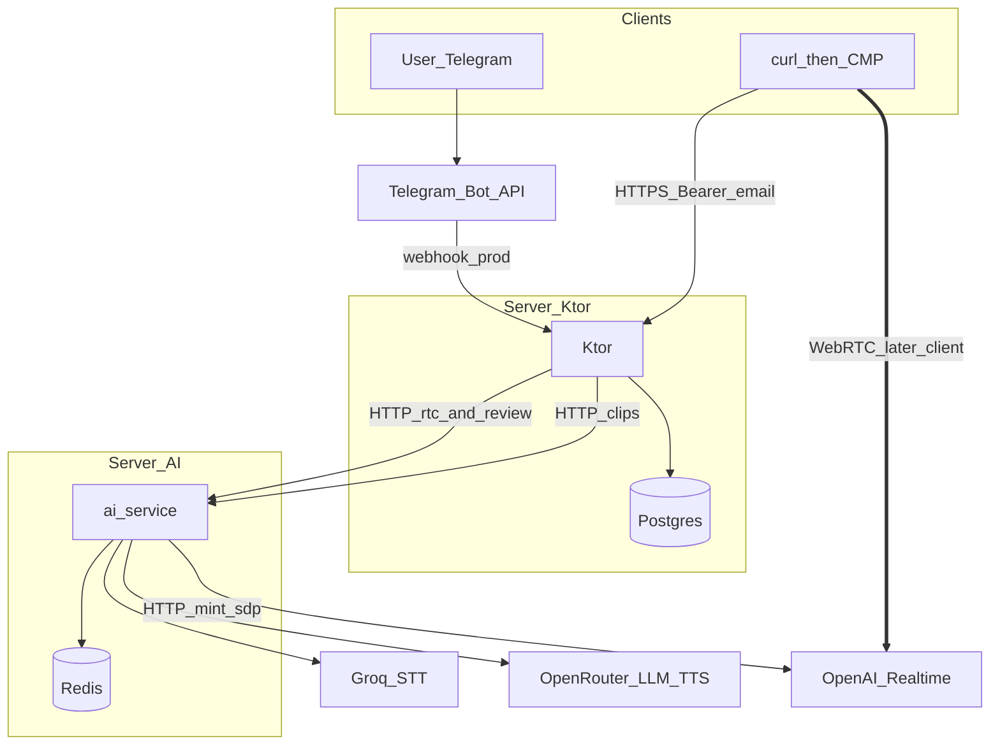
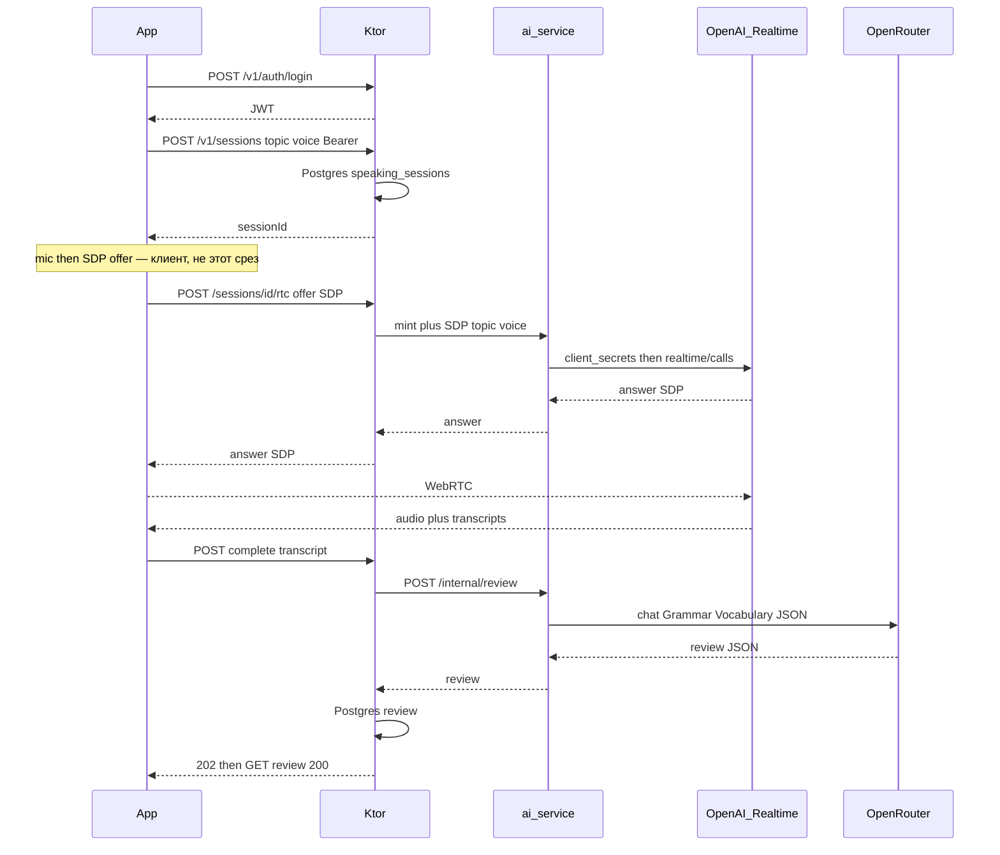

# MVP backend — срез «бэк готов»

**Дата:** 2026-09-19  
**Статус:** бэкенд среза на DEV; CMP клиент Auth/Home/Profile/sessions. Call/Review мок.  
**Контракт (ручки ↔ экраны):** [../integrations/2026-09-18-mobile-api.md](../integrations/2026-09-18-mobile-api.md) — что именно отдаёт Ktor и с какого UI это зовут.  
**Шире (сторы, OAuth, SMTP, dual-host, CI PR→dev):** [2026-09-19-mobile-mvp-backend.md](2026-09-19-mobile-mvp-backend.md) — бэклог, не этот срез.  
**Не этот документ:** [mvp-plan.md](mvp-plan.md) (полный продуктовый цикл).  
**Связанные:** [../design/2026-09-17-mobile-ui.md](../design/2026-09-17-mobile-ui.md), [../architecture/2026-09-17-cmp-client.md](../architecture/2026-09-17-cmp-client.md), [../integrations/2026-09-18-clip-session-api.md](../integrations/2026-09-18-clip-session-api.md)

Клипы Telegram как есть. Call: Ktor — публичная прокси (Bearer/SDP), ai-service — промпт и mint OpenAI Realtime. Медиа WebRTC клиент ↔ OpenAI, не через FastAPI. Прод-бота не трогаем.

## Что такое «бэк готов»

Curl (потом CMP) может: **войти → создать сессию с темой → получить SDP answer → после звонка прислать транскрипт → получить Grammar/Vocabulary.** Карточки «Последний разговор» на Home в этом срезе нет.

Клиентский WebRTC, AuthScreen и подключение моков в Compose **не** входят в этот срез. Realtime mint+SDP на сервере — входят: без них бэкенд это логин и JSON, а продукт — разговор.

## Progress

Обновлять в том же PR/сессии, что и код. Не оставлять галочки «на потом».

**Обновлено:** 2026-09-19  
**Остановились:** бэк на DEV проверен curl. CMP: Auth/Home/Profile/sessions живые; Call/Review мок до WebRTC + Realtime-ключа.

- [x] Контракт [mobile-api.md](../integrations/2026-09-18-mobile-api.md)
- [x] Предохранитель CI: не деплоить prod с `pull_request` (Redeploy DEV only; CMP/AI CI без SSH)
- [x] Ktor: Postgres, register/login, JWT
- [x] Ktor: `GET /v1/home`, `POST /v1/sessions`, complete/review
- [x] Закрыть публичный `/v1/clips`
- [x] Ktor: rtc-прокси → ai-service
- [x] ai-service: `POST /internal/realtime/call` (mint+SDP)
- [x] ai-service: `POST /internal/review`
- [x] CMP: Ktor client, JWT на диске, AuthScreen, Home/Profile с API, `POST /v1/sessions`
- [ ] CMP Call WebRTC + rtc/complete/review
- [ ] Local compose + прогон контракта curl’ом — не делаем; unit-тесты + DEV Redeploy после env

## Срезы

- [x] Контракт в [../integrations/2026-09-18-mobile-api.md](../integrations/2026-09-18-mobile-api.md)
- [x] CI: **не** деплоить prod с `pull_request` (предохранитель; dual-environment не делаем)
- [x] Ktor: Postgres, email/пароль, JWT Bearer, home/sessions/complete/review, rtc-прокси
- [x] ai-service: `POST /internal/realtime/call` (mint+SDP), `POST /internal/review`; клипы не трогаем
- [ ] Local compose: снято; интеграция — DEV Redeploy + curl, не compose

## Почему так, а не полный 2026-09-19 план

Полный план смешивает говорящий цикл с запуском в сторы. Для «бэк готов» не нужно:

| Выкинули | Почему |
| --- | --- |
| Google / Apple / SMTP / verify / reset / склейка | Сторы и anti-takeover. Desktop и так только почта. OAuth — отдельный слайс перед TestFlight/Play |
| `PATCH /v1/me`, язык UI, CC, цель, streak | Серверу для звонка нужен голос на `POST /sessions`. Остальное уже локально в CMP |
| `auth_tokens`, `email_tokens` | JWT с TTL; logout = стереть токен на клиенте. Писем нет |
| «Последний разговор» на Home | История сессий не в MVP; Review только сразу после Call |
| Random резолвит Python | Клиент или Ktor кидает кубик **до** mint, в сессию пишется конкретный `TopicKind` |
| `/internal/realtime/hangup`, Safety-Identifier, `pg_dump` | После первого живого звонка. Утечка Realtime умрёт за 60 мин у OpenAI |
| Два новых хоста + `DEV_TELEGRAM_*` | Прод уже одна машина. Бот для мобильного API не нужен; `setWebhook` не должен быть обязателен |
| PR → environment `dev` | Нужен только стоп «PR не едет на прод-бота» |

Не выкидываем: Ktor снаружи / Python внутри; ключ Realtime не в клиенте; клиповый `pipeline.py`; Postgres не Redis для пользователей; Bearer на app-роутах; закрытый публичный `/v1/clips`; отдельный spoken-промпт (не JSON из `SPEAKING_COACH_SYSTEM`).

## Архитектура

Два процесса, как сейчас: **Ktor** и **ai-service**. Клиенты REST только в Ktor. Telegram — клипы (in-process `HttpClipClient`). CMP Call — OpenAI Realtime.



- **Ktor** — TLS (на сервере), JWT, владелец `app-…` сессии, Postgres, проброс mint+SDP. Не зовёт `api.openai.com`, не держит Realtime-ключ, не хранит Speaky `instructions`.
- **ai-service** — клипы бота без изменений; новые `/internal/*` только с `X-Internal-Token`. Mint, spoken prompt, voice, SDP на OpenAI; post-call review через OpenRouter chat. UDP не слушает.
- **Медиа** — клиент ↔ OpenAI. LiveKit/aiortc не берём.

### Звонок



`ek_` живёт ~1 мин — mint+SDP одним HTTP Ktor→Python. Пока звонок идёт, Ktor слепой. Разбор после hangup.

Один пользователь = один активный `rtc`. Второй по той же сессии/user — 409.

## Контракт

Канон: [../integrations/2026-09-18-mobile-api.md](../integrations/2026-09-18-mobile-api.md) — ручки привязаны к экранам. DTO в `cmp/server/.../app/AppDtos.kt`.

App API на Ktor. Auth-эндпоинты без JWT; остальное `Authorization: Bearer`.

**Auth**

- `POST /v1/auth/register` `{ email, password, displayName }` → `{ token, user }`
- `POST /v1/auth/login` `{ email, password }` → `{ token, user }`
- `POST /v1/auth/logout` → 204 (клиент забывает JWT; сервер может no-op)

Пароль — hash (bcrypt/argon2). Почта **не** verified. Google/Apple не принимаем. Токен — JWT, TTL ~30 дней, в лог не пишем.

**App**

- `GET /v1/home` — `{ userName }`. Без lastConversation, streak, цели.
- `POST /v1/sessions` `{ topic, tutorVoice }` → `{ sessionId }`. `topic` — `Everyday` | `Work` | `Travel` (не `Random`: резолв до запроса). `tutorVoice` — `marin` | `cedar`.
- `POST /v1/sessions/{id}/rtc` — Bearer, SDP offer (`Content-Type: application/sdp` или JSON `{ sdp }`). Ktor → ai-service одним вызовом. Ответ: SDP answer. Клиенту не отдаём `ek_`.
- `POST /v1/sessions/{id}/complete` `{ turns: [{role, text}], durationSec }` — 202. Без user-реплик — 422, не фейковые баллы.
- `GET /v1/sessions/{id}/review` — 200 готово | 202 ещё считается | 422 слишком короткий | 5xx разбор не вышел (retry complete)

Клипы `/v1/clips` — только Telegram (in-process). Публичный прокси на `:443` убран. Telegram эти пути не использует.

`SpeakingCoachClient` к этому контракту **не** подключаем в этом срезе (клиент — следующий план).

Ktor сегодня **не** ставит `ContentNegotiation` на входящий JSON — для app-роутов поставить serialization + bearer.

## Postgres

На том же хосте/compose, что Ktor; слушает **только localhost:5432**. AI-хост к базе не ходит.

Таблицы:

- `users` — email unique, `password_hash`, `display_name`
- `speaking_sessions` — id вида `app-{userId}-{uuid}`, `user_id`, `topic`, `tutor_voice`, `duration_sec`, `openai_call_id` nullable, timestamps
- `reviews` — `session_id`, JSON Grammar/Vocabulary (форма экранов Review)

JDBC + миграции. Пользователей **не** кладём в Redis. SQLite не берём.

Сессии Telegram по-прежнему `tg-$chatId`. Redis бота (`session:{tg-…}`) с `app-…` не смешиваем. `/start` не чистит историю.

## ai-service

Клиповый `pipeline.py` **не** переписываем и не используем для CMP Call. CMP в Python напрямую не бьёт.

Ktor → ai-service: `X-Internal-Token`. Без него `/internal/*` 401. Python с интернета не светить.

- `POST /internal/realtime/call` — mint+SDP: spoken prompt, voice marin/cedar, topic, `audio.input.transcription`. Возврат: SDP answer + `openaiCallId` если есть.
- `POST /internal/review` — transcript turns → OpenRouter JSON Grammar/Vocabulary. Не `NOTE_POOL`. Не pronunciation/fluency. Клиповый notes-путь не менять.

Ключ Realtime только здесь. `ek_` живёт в стеке одного запроса, в Redis не пишем.

Прод-инстанс ai-service **не** трогаем. Новые хендлеры — DEV-хост AI, не local compose.

### Промпт gpt-realtime

Не chat `messages`. Поле `session.instructions` (plain text), задаём на mint:

```json
{
  "session": {
    "type": "realtime",
    "model": "gpt-realtime",
    "instructions": "<Speaky realtime text>",
    "output_modalities": ["audio"],
    "audio": {
      "input": {
        "turn_detection": { "type": "semantic_vad" },
        "transcription": { "model": "gpt-4o-mini-transcribe" }
      },
      "output": { "voice": "marin" }
    }
  }
}
```

**Не копировать** `SPEAKING_COACH_SYSTEM` из `ai-service/app/llm.py` (там JSON `reply`/`notes`). Spoken: только English, 2–4 коротких фразы, follow-up, не лекция, не озвучивать notes. Corrections — только post-call review.

## Инфра и CI

**Local:** unit-тесты (`:server:test`, `pytest`). Интеграция — DEV Redeploy, не compose.

**Сервер (не в этом срезе как блокер):** если понадобится HTTPS для телефона — **один** extra-хост, топология как у прода (Ktor + Postgres + AI + Redis). Не два хоста. Не второй бот. Не `CMP_SERVER_HOST`.

**CI:** push/PR не деплоит. Выкат — Redeploy (`main` → prod). App-контур — DEV-хосты, не `CMP_SERVER_HOST`.

Имена секретов прода **не** переименовываем и не подставляем в app-контур.

Локальные env (имена): `DATABASE_URL`, `AI_INTERNAL_TOKEN`, `AI_SERVICE_BASE_URL`, `OPENAI_REALTIME_API_KEY` (только ai-service), плюс уже существующие `GROQ_API_KEY` / `OPENAI_API_KEY` (OpenRouter) для клипов и review. JWT signing key — env, не в git.

## Порядок внедрения

Сначала `:server` + тонкий RTC-контроль в Python. Клиповый pipeline не рефакторим. Telegram на проде не отъезжает. Каждый слайс со своими тестами.

1. Предохранитель CI (PR ≠ prod)
2. Контракт `mobile-api.md`
3. Ktor: Postgres, register/login, JWT, home/sessions/complete/review; **handlers бота не рефакторим**
4. Закрыть публичный `/v1/clips`
5. ai-service: mint+SDP, post-call review, internal token
6. Compose local: прогнать контракт curl’ом (rtc можно фикстурой SDP / записанным ответом OpenAI)

Дальше (не этот файл): CMP HTTP, AuthScreen, WebRTC, OAuth, SMTP, dual-host, hangup.

## Сознательно не делаем

- History, карточка «Последний разговор» на Home, pronunciation/fluency/speed, упражнения, смена BotFather
- Google/Apple, Firebase, письма, смена пароля
- Свои модели / GPU / coturn
- Деплой этой ветки на прод-бота; `docker rm redis`
- Правки `bin/`, research-док как истина
- CMP REST в ai-service; ключ Realtime в клиенте
- Персист цели на день, streak, CC, языка UI
