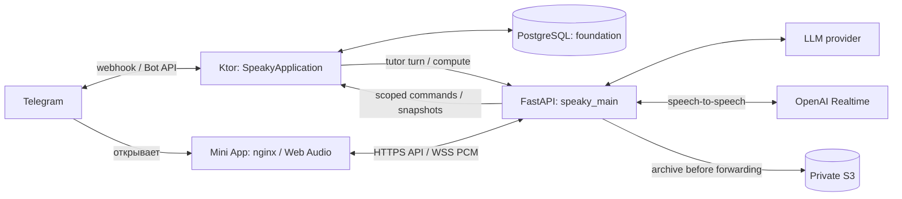

# Архитектура Speaky

Единственный справочник **реализованной архитектуры SP-00–SP-08**: компоненты, данные, потоки и причины решений.
Он описывает код рабочего дерева, а не текущую конфигурацию сервера.
Результаты локальных проверок и границы готовности — в [статусе](ai_docs/status.md),
команды оператора — в [эксплуатации](ai_docs/integrations/operations.md#sp-00-новый-runtime-и-перенос-текущего-чата).

## Компоненты и границы

```mermaid
flowchart LR
  tg[Telegram] <-->|webhook / Bot API| ktor[Ktor: SpeakyApplication]
  ktor <--> pg[(PostgreSQL: foundation)]
  ktor -->|tutor turn / compute| ai[FastAPI: speaky_main]
  ai -->|scoped commands / snapshots| ktor
  ai <--> llm[LLM provider]
  tg -->|открывает| mini[Mini App: nginx / Web Audio]
  mini <-->|HTTPS API / WSS PCM| ai
  ai <-->|speech-to-speech| rt[OpenAI Realtime]
  ai -->|archive before forwarding| s3[(Private S3)]
```

Три поставляемых компонента: Ktor, FastAPI и отдельный статический Mini App frontend.
Foundation, Text Tutor, Context Builder и Learning Engine — модули backend/AI.
Отдельных сервисов для каждого логического блока нет. Redis не входит в новый runtime.

| Компонент | Ответственность |
| --- | --- |
| Ktor / foundation | Единственный владелец состояния ученика, бизнес-операций, истории, фоновых задач и контроля доступа |
| PostgreSQL | Student/identity, profile/goal/memory, Lesson/Call Session, Schedule, payment/entitlement, Roadmap, Plan/Evaluation, history, jobs и receipts |
| Telegram adapter | Проверка webhook, сохранение private-text входа, запуск хода, отправка ответа и учёт результата доставки |
| Python FoundationTutor | Диалог Саши и native tools; все изменения выполняются через Ktor |
| Python ContextBuilder | Ограниченные проекции общего состояния для text, voice и learning; чтение не меняет профиль |
| Python LearningEngine | Вычисление результатов фоновой работы; применение результата контролирует backend |
| LLM | Формулировка ответа, выбор tools и интерпретация контекста; не владелец состояния и прав доступа |

### Точки входа

- Kotlin [`Application.kt`](cmp/server/src/main/kotlin/com/eliteteam/speakingcoach/Application.kt) вызывает
  [`SpeakyApplication.kt`](cmp/server/src/main/kotlin/com/eliteteam/speakingcoach/SpeakyApplication.kt).
  Он подключает foundation, worker, `/health` и Telegram webhook при соответствующей конфигурации.
- AI Docker запускает [`app.speaky_main:create_app`](ai-service/app/speaky_main.py).
  Этот root создаёт FoundationClient, ContextBuilder с MemorySelector, FoundationTutor, LearningEngine и Realtime routes.
- Frontend собирается из [`mini-app/src/`](mini-app/src/) и раздаётся отдельным nginx-контейнером.
- Ktor требует PostgreSQL и завершённый import marker. Без marker новый backend не стартует.
  Это защищает существующий чат от случайного запуска с пустым профилем.

## Ход текстового диалога

1. Webhook проверяет секрет Telegram. Private-text update сохраняется до HTTP ACK.
2. Backend связывает Telegram identity с Student и обрабатывает входы по порядку.
   Lease/fence защищают обработку от конкурирующего или просроченного исполнителя.
3. Ktor создаёт ограниченный execution scope и вызывает AI tutor turn.
4. ContextBuilder читает backend snapshot. Модель получает общий профиль, цель и ограниченную историю.
5. Native tools вызывают backend commands. Backend проверяет владельца, scope, источник, версии и idempotency.
6. Результат операции и reply сохраняются. После сбоя используется сохранённый результат;
   уже выполненная запись не становится новой операцией.
7. Telegram adapter отправляет ответ и фиксирует исход. Неизвестная доставка не повторяется вслепую.

Успешный ACK означает сохранённый вход, а не готовый ответ. Успех tool подтверждается backend receipt,
а не фразой модели. Внешняя доставка Telegram не имеет гарантии exactly-once.
Правила беседы и trial остаются в [продуктовом поведении SP-01](ai_docs/plans/2026-11-09-sp01-text-onboarding.md).

## Данные, память и общий контекст

Общий профиль принадлежит Ktor/PostgreSQL. Python не поддерживает вторую изменяемую копию профиля.
Text, Voice и Learning используют одну идентичность и проекции одного состояния через ContextBuilder.
Голосовой runtime использует этот контекст после admission; качество передачи контекста требует живой приёмки.

- Заявленные пользователем факты, самооценка и учебные observations разделены.
  Observations сохраняют источник, версию анализа и неопределённость.
- Личные факты, предложенные AI, остаются скрытыми candidates до подтверждения источником пользователя.
- Контекст ограничен бюджетами; модель не получает всю историю без ограничений.
- Новая сырая история хранится 30 дней. Копирование не продлевает срок источника.
  Импортированная история TutorStore сохраняет прежние семидневные deadlines.
- Forget/delete очищают данные нового пути и отзывают старые scopes/jobs через epoch.
  Forget консервативно очищает raw history и производные копии, включая прежние значения цели;
  другие подтверждённые факты сохраняются.
- После восстановления backup до запуска применяется свежий внешний deletion ledger.
  Очистка сохранённых legacy-хранилищ этим механизмом не обещается.

## Фоновая работа и граница урока

FoundationJobs хранит очередь в PostgreSQL. Worker получает lease и fence, вычисляет результат вне DB-транзакции,
затем backend применяет его после проверки источника, epoch, зависимостей и версий.
Просроченный worker не может перезаписать актуальное состояние. Retry и диагностика доступны оператору.

Lesson/Call Session, Schedule, entitlement, Roadmap, Plan/Evaluation имеют backend-модель и операции.
Realtime получает общий контекст только после backend admission. Для regular отсутствующий или устаревший
обязательный план блокирует первый вход; trial admission использует встроенный briefing.

Shipping root использует `LessonPlanner` из `regular_lesson.py`: модель готовит для regular
отдельные objective/topic/strategy; trial сохраняет briefing. Backend применяет план с проверкой
версий и завершённости предыдущих анализов. Неверный ответ модели не заменяется фиктивным планом.
`TrialAnalyzer` сохраняет качественные наблюдения с источниками. `TrialWorker` материализует
расписание и отправляет уведомления через durable outbox. Настоящая оплата не реализована; персональный roadmap описан в SP-06 ниже.

## Внутренние API и доверие

| Направление | Интерфейс |
| --- | --- |
| Ktor → AI | `POST /internal/foundation/tutor/turn`, `POST /internal/foundation/compute` |
| AI → Ktor | `/internal/foundation/v1`: `POST /commands`, `GET /snapshot`, `/operations/{id}`, `/jobs`, `/diagnostics` |
| Проверка процесса | `/health` каждого сервиса |

Внутренние запросы используют `X-Internal-Token`; операции дополнительно связаны с `X-Execution-Scope`.
Scope выдаёт backend, а не модель. Service token сам по себе не разрешает произвольную запись за другого ученика.
Версии и receipts делают конфликт или повтор явным. Ошибка хранилища не переключает работу на in-memory или Redis.
Конфигурация, сетевые адреса и секреты перечислены только в [operations](ai_docs/integrations/operations.md).

## Почему устроено так

| Решение | Причина |
| --- | --- |
| Единый владелец данных в backend | У чата, голоса и learning одна цель и память; нет двусторонней синхронизации отдельных профилей |
| Характер и стратегия режима разделены | Общая Kora сохраняется; backend задаёт textMode, ContextBuilder добавляет только стратегию знакомства или обычного диалога |
| LLM выбирает tools, backend исполняет | Сохраняется свободный диалог; ownership, версии и успех операции не зависят от ответа модели |
| Durable первое приветствие | Фиксированные реплики имеют отдельные receipts; новый вход отменяет остаток до следующего send claim; подтверждённые отправки входят в общую историю |
| Durable inbox, runs и receipts | Перезапуск не теряет подтверждённый вход и не повторяет уже выполненную бизнес-операцию |
| Compute вне транзакции | Медленный AI-вызов не удерживает DB-транзакцию; актуальность проверяется при apply |
| Structured Memory и bounded context | Факты имеют источник; embeddings и семантический поиск не обязательны для текущего этапа |
| Отдельные shipping roots | Legacy не запускает скрытые routes/workers и не возвращает Redis-зависимость новому пути |
| Import marker до запуска | Переход выполняется только после сверки перенесённого TutorStore |

## Изоляция legacy и CMP

`app.main`, прежний Kotlin wiring, calls, clips, Vocabulary Builder, reminders, dashboards и app API
сохранены в исходниках, но не подключены к новым shipping roots. Старые HTTP adapters используются в test harness,
который не входит в fat JAR. Промежуточные legacy PG adapters также не являются активным владельцем данных.

Переносится только текущий TutorStore. Legacy Redis namespaces не мигрируют в рамках SP-00.
Серверные Redis/PG данные и применённые Flyway-миграции сохраняются.
Порядок freeze/export/import/reconciliation описан один раз в [runbook](ai_docs/integrations/operations.md#sp-00-новый-runtime-и-перенос-текущего-чата).

CMP Android/iOS/Desktop остаётся отдельным прототипом. Его app API не монтируется новым runtime.
Устройство клиента, WebRTC и прежний HTTP-контракт собраны в [справочнике CMP](ai_docs/integrations/mobile-api.md).
Справочники voice/practice/analytics описывают сохранённый код и не являются перечнем активных маршрутов SP-00.

## Карта исходников

Пути Kotlin ниже относительны к `cmp/server/src/main/kotlin/com/eliteteam/speakingcoach/`.

| Задача | Файлы |
| --- | --- |
| Запуск, маршруты и доступ | `SpeakyApplication.kt`, `foundation/FoundationRoutes.kt`, `FoundationIdentity.kt`; `ai-service/app/speaky_main.py`, `foundation_api.py` |
| Бизнес-операции и данные | `foundation/FoundationService.kt`, `FoundationDatabase.kt`, `LessonManagement.kt`, `LearningState.kt` |
| Сохранение входа и восстановление хода | `foundation/TelegramTextIntake.kt`, `ConversationRuns.kt`, `FoundationChat.kt`; `ai/TutorClient.kt` |
| Диалог и native tools | `ai-service/app/foundation_tutor.py`, `tutor.py`, `foundation_client.py` |
| Общая память и контекст | `foundation/StructuredMemory.kt`, `ConversationHistory.kt`, `TutorContextOperations.kt`; `ai-service/app/context_builder.py` |
| Фоновые вычисления | `foundation/FoundationJobs.kt`, `FoundationWorker.kt`, `BackgroundContracts.kt`; `ai-service/app/learning_engine.py`, `lesson_voice.py` |
| Импорт, очистка и восстановление | `foundation/TutorStateImport.kt`, `FoundationImportCli.kt`, `FoundationMaintenance.kt`, `FoundationMaintenanceCli.kt`; `ai-service/scripts/export_tutor_state.py` |
| Голос и frontend | `foundation/TrialAccess.kt`, `TrialCommands.kt`; `ai-service/app/trial_api.py`, `trial_realtime.py`, `trial_audio.py`; `mini-app/src/` |
| Roadmap, память и прогресс | `foundation/RoadmapPreparation.kt`, `MemoryOperations.kt`, `LessonMemory.kt`, `LearningProgress.kt`; `ai-service/app/roadmap.py`, `memory_context.py`, `memory_tools.py` |
| Подписка и расписание | `foundation/SubscriptionBilling.kt`, `TrialSchedule.kt`, `TrialWorker.kt`; `ai-service/app/subscription_tools.py`, `trial_tools.py` |
| Прототип и поставка | `cmp/app/`, `infra/`, `.github/workflows/` |

[Исходная архитектура MVP v1](ai_docs/architecture/speaky-mvp-high-level-architecture-v1.md) задаёт целевые обязанности будущего MVP.
Она не описывает текущий runtime. [План SP-00](ai_docs/plans/2026-11-10-sp00-foundation.md) фиксирует объём задачи,
[статус](ai_docs/status.md) — доказательства проверок и ограничения.
Архитектурные изменения следует отражать здесь, не создавать параллельную system map.

## SP-02: пробный голосовой урок

Самостоятельный `mini-app/src` собирается в nginx frontend; AI не раздаёт UI. `trial_api.py`
проверяет подписанное Telegram initData через Ktor `TrialAccess`. Backend владеет Lesson,
Call Session, scope и admission. Browser не получает provider key или право выполнить tool.

`RealtimeTrialSession` в `trial_realtime.py` соединяет Web Audio с OpenAI Realtime
(`gpt-realtime-2.1`, Marin) через серверный WebSocket relay. Relay архивирует оба PCM-потока
в private S3 и подтверждает metadata в PostgreSQL **до** пересылки. Direct browser→provider
не выбран: серверный архив через sideband не подтверждён, а browser upload может потеряться
при закрытии WebView. Дополнительные S3/DB операции и RTT требуют живого замера.

`semantic_vad` использует `eagerness=medium`. Speech-start останавливает playback; сервер
согласует `conversation.item.truncate` с ограниченным playback report. Отчёт клиента не
доказывает, что ученик услышал звук. Входной ASR transcript служит истории и анализу,
не генерации ответа. Модель получает `finish_after_reply` и memory tools SP-07.

`TrialCommands` сохраняет события, завершает урок и ставит evaluation/notice. `TrialPlanner`
даёт briefing, `TrialAnalyzer` анализирует разговор, `TrialWorker` обслуживает follow-up.
V39 добавляет voice lease/scope, audio metadata и demo receipt. Аудио удаляется через 30 дней;
backup и S3 lifecycle остаются отдельными гарантиями. Reconnect открывает новый provider session
в том же Lesson. Ограничение одного транспорта — 50 минут; оно не означает завершение Lesson.
Старые `TrialSession`/STT/TTS не создаются shipping root.

Контракт ученика и живая матрица приёмки — [SP-02](ai_docs/plans/2026-11-11-sp02-trial-lesson.md).
Конфигурация, архив и диагностика — [operations](ai_docs/integrations/operations.md#sp-02-mini-app-и-пробный-голосовой-урок).

## Регулярные уроки и расписание SP-03/SP-04

`TrialSchedule.schedule.agree` сохраняет согласованную серию и материализует executable regular
Lesson на 14-дневном горизонте. `TrialWorker` продлевает горизонт, отправляет уведомления
и фиксирует no-show. Перенос/отмена оставляют occurrence exception, чтобы worker не воссоздал
встречу. `LessonManagement` исполняет команды под `lockStudent`, с версиями и receipts.
V40 хранит DST issues и версии уведомлений. Старые placeholders не активируются автоматически;
явный перенос выбранного placeholder может сделать именно его executable.

`LessonPlanner` готовит regular objective/topic/strategy из общего контекста. Первый admission
требует актуального плана и завершённых прошлых анализов; он сохраняет execution_snapshot.
Reconnect использует этот снимок и исходное время конца. После 50 минут provider session
меняется в безопасной паузе; бесшовность требует живой проверки. `lesson.next` читает только
сохранённую будущую встречу. Завершение regular не создаёт trial follow-up.

Детальные операции, время, DST и проверка доставки — в [SP-03](ai_docs/plans/2026-11-12-sp03-regular-lessons.md)
и [SP-04](ai_docs/plans/2026-11-12-sp04-scheduling.md).

## Подписка SP-05

`SubscriptionBilling` владеет subscription, receipt и entitlement в PostgreSQL. V41 добавляет
checkout terms и billing events. FoundationChat отправляет карточку из backend-условий;
LLM не подтверждает оплату. Настроенный opt-in mock обрабатывает Telegram callback через
`MockBillingTelegram` и `MockPaymentAdapter`. `TrialAccess` проверяет entitlement при первом
regular admission и сохраняет его для reconnect. Trial остаётся бесплатным.
Реального provider нет. Договорённости, идемпотентность и границы mock — в
[SP-05](ai_docs/plans/2026-11-12-sp05-subscription.md); конфигурация — в [operations](ai_docs/integrations/operations.md#sp-05-тестовая-подписка).

## Roadmap и подготовка SP-06

`roadmap.prepare` использует FoundationJobs/LearningEngine. `RoadmapPlanner` вычисляет вне
транзакции, `RoadmapPreparation` проверяет источники и версии перед применением.
ContextBuilder передаёт одну актуальную проекцию text/voice/learning; существующий SP-03 planner
сохраняет roadmap revision в плане. Первый admission фиксирует execution_snapshot, а новая цель,
исправление памяти и перенос отзывают будущую подготовку. V42 сохраняет результат review в job.

Ошибки анализа, roadmap и плана доступны admission/Mini App и `lesson.list`. Завершённые до SP-06
анализы не получают roadmap job автоматически при deploy. Команды диагностики и retry — в
[operations](ai_docs/integrations/operations.md#sp-06sp-08-jobs-память-и-прогресс).
Правила активации и адаптации — в [SP-06](ai_docs/plans/2026-11-12-sp06-roadmap.md).

## Память репетитора SP-07

`MemoryOperations` в PostgreSQL владеет scoped facts, candidates и disputed observations.
V43 добавляет ограничения упоминания и сроки актуальности. Native memory tools общие для
Telegram и Realtime; голос использует источник только после durable append транскрипта.
`TrialAnalyzer` анализирует доступные части trial/regular; `LessonMemory` проверяет источники
и версии. `MemorySelector` выбирает bounded контекст; Core и запреты сохраняются вне выборки.

Forget очищает производные копии и отзывает epoch. Voice закрывает provider session,
а незавершённый урок возвращается на подготовку без удалённого execution_snapshot.
Четыре уровня памяти и пользовательские правила — в [SP-07](ai_docs/plans/2026-11-12-sp07-memory.md).
Лимиты, ошибки и recovery — в [operations](ai_docs/integrations/operations.md#sp-06sp-08-jobs-память-и-прогресс).

## Прогресс SP-08

Общий `TrialAnalyzer` добавляет evidence metadata к observations. `RoadmapPlanner` оценивает
качественную динамику в том же `roadmap.prepare`; `LearningProgress` сверяет актуальные
источники вне relevance-выборки. V44 хранит metadata и versioned `progress_review`.
Смена transcript/review revision отзывает подтверждение, forget удаляет производные результаты.

Одна backend-проекция доступна ContextBuilder и Mini App `action=progress` после Telegram
initData auth. Просмотр не запускает Lesson, entitlement или jobs. Telegram My Progress открывает
`MINI_APP_URL` с `?view=progress`. Критерии навыка, ограничения Fluency и UX — в
[SP-08](ai_docs/plans/2026-11-12-sp08-progress.md).

Подтверждение trial: `TutorBookingDelivery` отправляет HTML-виджет Telegram с версией состояния и текстовой подписью;
V46 отличает старые текстовые сообщения. `TrialReminders` использует пояс/версию урока и durable receipts.
Экспорт календаря проходит Telegram auth/ownership в `TrialAccess`, затем `trial_api`/`lesson_calendar.py`;
он не даёт доступ к звонку или аккаунту календаря. Контракты доставки и ограничения — в [tutor-chat](ai_docs/integrations/tutor-chat.md).
